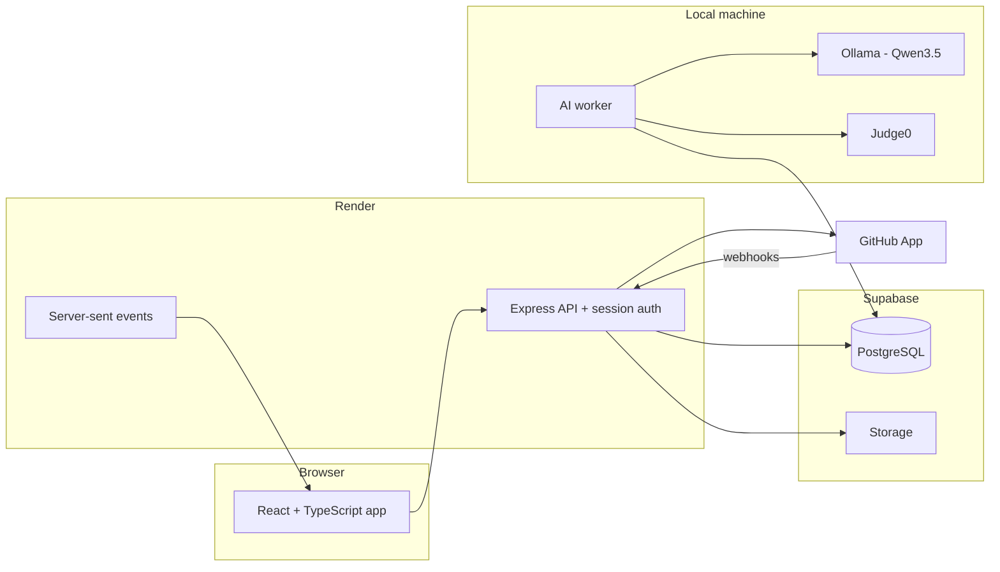
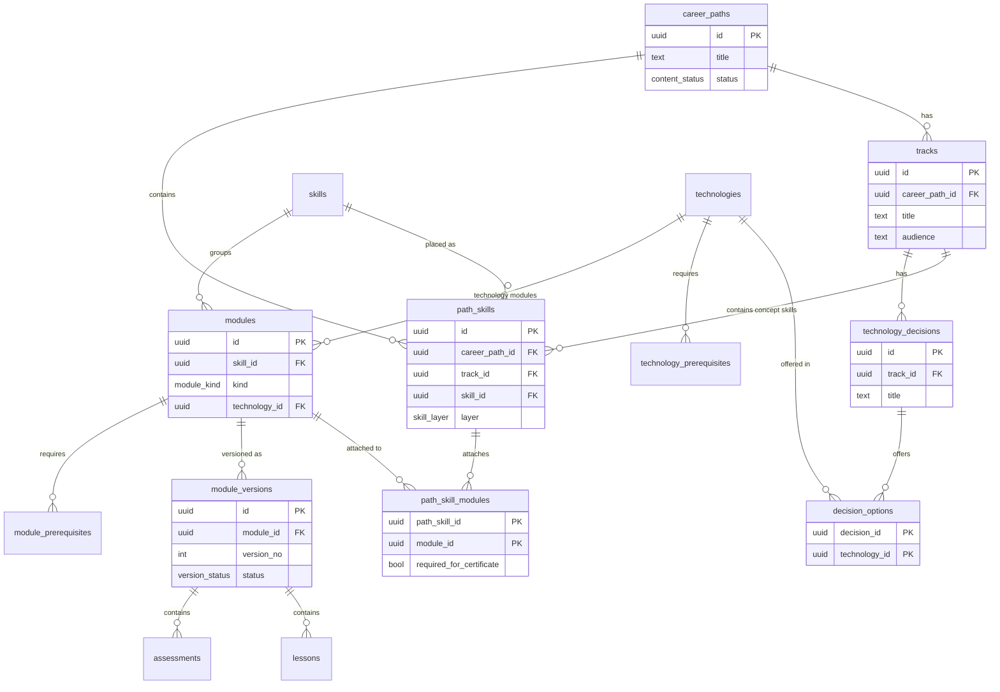
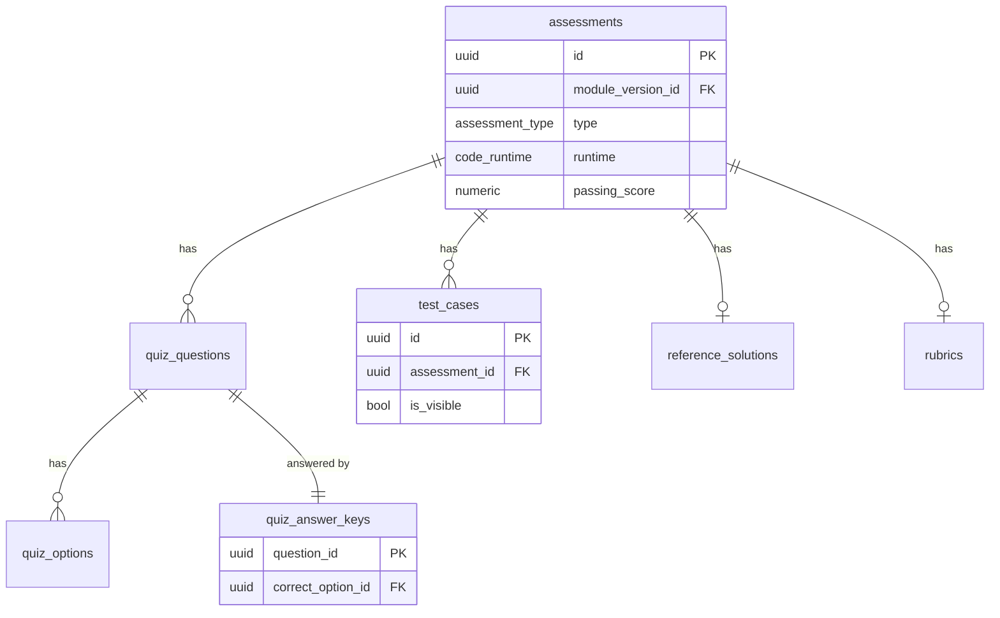
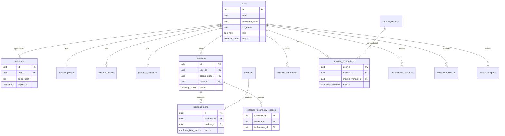
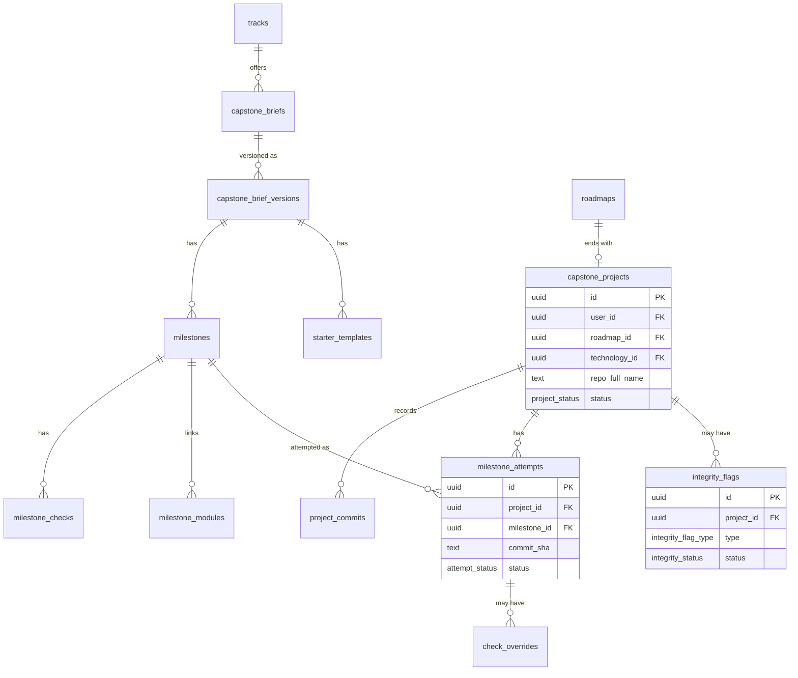
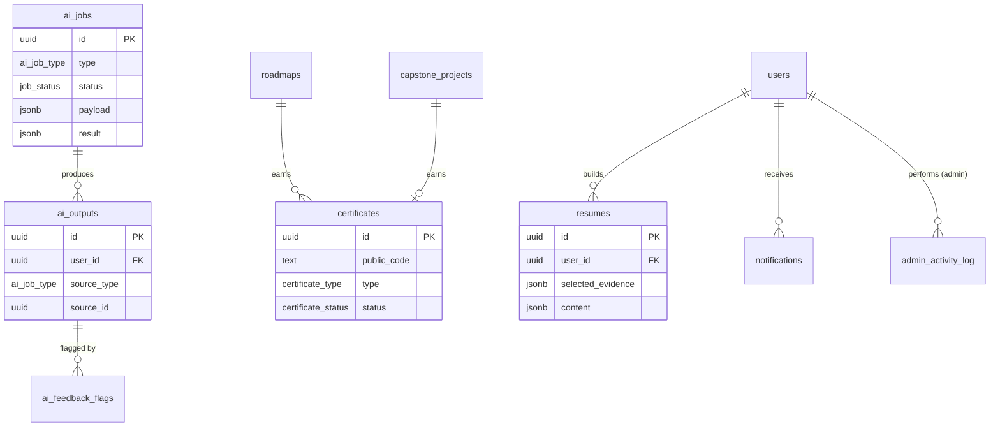

# First Commit: Database Schema

| | |
|---|---|
| **Database** | PostgreSQL on Supabase (any PostgreSQL host works) |
| **Backend** | Node.js with Express, deployed on Render |
| **Authentication** | Handled by the backend, not by Supabase Auth |
| **Schema file** | [`supabase/migrations/0001_initial_schema.sql`](../supabase/migrations/0001_initial_schema.sql) |
| **Related documents** | project-proposal.md, design.md |
| **Version** | 0.2 (draft) |

## Table of Contents

1. [Architecture](#1-architecture)
2. [Design Principles](#2-design-principles)
3. [Entity Relationship Diagrams](#3-entity-relationship-diagrams)
4. [Table Reference](#4-table-reference)
5. [Key Rules Enforced by the Database](#5-key-rules-enforced-by-the-database)
6. [Security: What the Backend Must Enforce](#6-security)
7. [Database Functions](#7-database-functions)
8. [Common Flows](#8-common-flows)
9. [Hosting and Setup Notes](#9-hosting-and-setup-notes)

---

# 1. Architecture

Supabase provides PostgreSQL and file storage. The Express backend owns authentication, all business rules, and every permission check. The AI model and the code sandbox run on the local machine.



| Part | Responsibility |
|---|---|
| **React app** | Talks only to the Express API. It never connects to the database. |
| **Express API** | Sign up, log in, sessions, all reads and writes, GitHub webhooks, certificate issuance |
| **PostgreSQL** | Stores everything, with constraints and triggers enforcing the rules that must always hold |
| **Supabase Storage** | Lesson images and certificate PDFs, since Render's free plan has no permanent disk |
| **Local worker** | Claims AI jobs and code submissions, runs Judge0 and Ollama, writes results back |
| **Server-sent events** | Pushes finished feedback, check results, and notifications to the browser |

**Why the webhook problem is solved:** the Express service on Render has a public HTTPS address, so GitHub can send push events straight to it. The worker stays on the local machine and only makes outgoing connections, because it pulls jobs from the database rather than waiting to be called.

# 2. Design Principles

**The backend is the only way in.** No browser connects to the database, so there is one place where permission checks happen: the Express API. Every endpoint resolves the session to a user and filters by that user's id. This is also the main risk of the design, which is why Section 6 lists the checks each endpoint must make.

**Evidence is written only by server code.** Tables that prove learning (`module_completions`, `assessment_attempts`, `milestone_attempts`, `certificates`) are never written from data the browser sends. Scores come from grading on the server, and certificates are issued by the backend after it checks the requirements itself.

**Progress belongs to the learner, not the roadmap.** `module_completions` has one row per learner per module. Every roadmap reads from it, so passing Git basics once counts in all roadmaps.

**Content is versioned.** Modules and capstone briefs have stable identities (`modules`, `capstone_briefs`) and numbered versions (`module_versions`, `capstone_brief_versions`). Learner progress points to the exact version taken.

**Nothing learners depend on is hard-deleted.** Content is archived with `status`. Foreign keys to evidence use `on delete restrict`, so a module with completions cannot be deleted by accident.

**Secrets stay out of responses.** Quiz answer keys, reference solutions, rubrics, hidden test cases, and AI prompts live in their own tables so no learner-facing query selects them by accident.

**Passwords and tokens are never stored as they are used.** `users.password_hash` holds an argon2id or bcrypt hash, and session and token tables store a hash of the value in the cookie or email link, so a database copy cannot be replayed as a login.

**Flexible details use `jsonb`; relationships use tables.** Lesson content, survey answers, and check results are `jsonb`. Anything the platform queries, joins, or enforces rules on has its own columns and foreign keys.

---

# 3. Entity Relationship Diagrams

Only key columns are shown. See [`supabase/migrations/0001_initial_schema.sql`](../supabase/migrations/0001_initial_schema.sql) for full definitions.

## 3.1 Curriculum



## 3.2 Assessments



## 3.3 Learners, Roadmaps, and Progress



## 3.4 Capstone Projects



## 3.5 AI, Certificates, and Platform



---

# 4. Table Reference

## 4.1 Accounts and Learner Profiles

| Table | Purpose | Key notes |
|---|---|---|
| `users` | One row per account: email, password hash, name, role, status | Emails are unique case-insensitively. `full_name` is used on certificates. |
| `sessions` | Logged-in sessions | Stores a hash of the cookie value, with an expiry. Kept in the database so sessions survive Render restarts. |
| `email_verification_tokens` | One-time links for verifying an email | Hashed, expiring, single use |
| `password_reset_tokens` | One-time links for resetting a password | Hashed, expiring, single use |
| `auth_attempts` | Recent login and reset attempts | Lets the backend slow down or lock an account under attack |
| `learner_profiles` | Survey answers, goal, weekly hours, onboarding step | `onboarding_step` is what sends a returning learner back to the page they stopped at |
| `resume_details` | Contact details and education for the resume | Kept separate so accounts stay minimal |
| `github_connections` | GitHub account and App installation | One per learner |

## 4.2 Curriculum

| Table | Purpose | Key notes |
|---|---|---|
| `career_paths` | Target positions | `status`: draft, published, archived |
| `skills` | Reusable skills (JavaScript, State) | Shared across paths |
| `technologies` | Reusable technologies (React, Vue, Django) | Shared across tracks |
| `technology_prerequisites` | e.g., Next.js requires React | For future options |
| `tracks` | Specializations within a path | `audience` text helps the AI match learners |
| `technology_decisions` | A choice point in a track | Full-stack has two decisions |
| `decision_options` | Technologies offered at a decision | Includes comparison details for the choice page |
| `path_skills` | Places a skill in a path | `track_id` null means core |
| `path_skill_modules` | Attaches modules to a placed skill | `required_for_certificate` drives certificate rules |
| `modules` | Stable module identity | `kind`; `technology_id` required only for technology modules |
| `module_versions` | Numbered content versions | Only one `published` version per module |
| `lessons` | Ordered lessons in a version | Content stored as `jsonb` rich text |
| `module_prerequisites` | Module order rules | Cannot reference itself |

## 4.3 Assessments

| Table | Purpose | Learner access |
|---|---|---|
| `assessments` | Quiz or code exercise per version | Read |
| `quiz_questions`, `quiz_options` | Questions and choices | Read |
| `quiz_answer_keys` | Correct option per question | None |
| `test_cases` | Tests for code exercises | Visible cases only |
| `reference_solutions` | Admin's working solution | None |
| `rubrics` | Criteria for the Code Review AI | None |

## 4.4 Roadmaps and Progress

| Table | Purpose | Key notes |
|---|---|---|
| `roadmaps` | A learner's roadmap for a path | Created by the worker after AI generation |
| `placement_results` | Placement scores per skill | |
| `roadmap_technology_choices` | Decision outcomes | Chosen technology must be a valid option for that decision |
| `roadmap_items` | Modules in a roadmap and their order | `source` records why each item exists |
| `module_enrollments` | Version a learner is taking | Protects in-progress learners from updates |
| `lesson_progress` | Completed lessons | |
| `assessment_attempts` | Graded quiz attempts | Written by `submit_quiz_attempt()` |
| `code_submissions` | Submitted code and results | Learners insert as `queued`; worker writes results |
| `module_completions` | Verified evidence per module | Server-written only |

## 4.5 AI

| Table | Purpose | Key notes |
|---|---|---|
| `ai_jobs` | Queue for the local worker | Claimed with `claim_next_ai_job()` |
| `ai_outputs` | Feedback, explanations, and generated text shown to learners | Linked to the source by `source_type` and `source_id` |
| `ai_feedback_flags` | "Was this wrong?" reports | Learners can flag only their own outputs |
| `ai_prompts` | Versioned prompts per AI component | One active prompt per component; version recorded on each job for evaluation |

## 4.6 Capstone and GitHub

| Table | Purpose | Key notes |
|---|---|---|
| `capstone_briefs`, `capstone_brief_versions` | Project briefs and versions | Same versioning rules as modules |
| `starter_templates` | Template repository per technology | |
| `milestones` | Ordered steps with criteria and checklist | |
| `milestone_modules` | Modules linked to a milestone | |
| `milestone_checks` | Automatic checks | file_exists, workflow_test, deployment_url |
| `capstone_projects` | A learner's project and repository | One per roadmap |
| `project_commits` | Pushed commits | Used for commit timelines and integrity signals |
| `milestone_attempts` | Check runs per pushed commit | Only one complete attempt per milestone |
| `check_overrides` | Admin corrections to failed checks | Reason required |
| `integrity_flags` | Signals for admin review | Decision reason required once decided |
| `github_events` | Raw webhook deliveries | `delivery_id` unique prevents processing duplicates |

## 4.7 Certificates, Resumes, and Platform

| Table | Purpose | Key notes |
|---|---|---|
| `certificate_templates` | Certificate designs | One active template per type |
| `certificates` | Issued certificates | `recipient_name` is a snapshot; one valid certificate per roadmap and type |
| `resumes` | Generated and edited resumes | `ai_fields` tracks AI-written text not yet edited |
| `notifications` | In-app notifications | |
| `platform_settings` | Passing scores and learning rules | Key-value `jsonb` |
| `admin_activity_log` | Record of sensitive admin actions | Append-only |

---

# 5. Key Rules Enforced by the Database

| Rule | How it is enforced |
|---|---|
| Learners cannot mark modules as passed | The backend is the only writer of `module_completions`; no endpoint accepts a completion from the browser |
| Quiz answers never reach the browser | Answer keys are in their own table, and grading happens in the backend |
| Hidden test cases stay hidden | The backend selects test cases with `is_visible = true` for learner responses |
| Learners cannot fake passing code | Submission endpoints accept only the files; results are written after the worker runs the tests |
| Emails are unique regardless of case | Unique index on `lower(email)` |
| A stolen database copy cannot be replayed as a login | Passwords and session and reset tokens are stored only as hashes |
| One published version per module or brief | Partial unique index on `status = 'published'` |
| Technology modules always name a technology | Check constraint on `modules` |
| Core skills have no track; concept skills do | Check constraint on `path_skills` |
| A chosen technology must belong to the decision | Composite foreign key to `decision_options` |
| A milestone is completed once | Partial unique index on complete attempts |
| One valid certificate per roadmap and type | Partial unique index on `status = 'valid'` |
| Project certificates reference a project | Check constraint on `certificates` |
| Revocations and integrity decisions have reasons | Check constraints |
| Override completions have a reason | Check constraint on `module_completions` |
| Learners cannot promote themselves to admin | No endpoint updates `users.role`; the first admin is set directly in SQL |
| Admin actions cannot be erased | Trigger blocks update and delete on `admin_activity_log` |
| Evidence cannot be orphaned by deleting content | `on delete restrict` foreign keys |
| Duplicate GitHub webhooks are ignored | Unique `delivery_id` |

---

# 6. Security

Because the database no longer knows who is asking, the Express backend is the only thing standing between an account and other people's data. Treat this section as a checklist while building endpoints.

## 6.1 What Every Request Must Do

1. **Resolve the session.** Read the session cookie, hash it, look it up in `sessions`, and reject expired sessions. Load the user's `role` and `status`.
2. **Reject suspended accounts** before anything else.
3. **Filter by the user's id**, always from the session, never from a value in the request body or query string.
4. **Check ownership on every id in the URL.** A roadmap, submission, or project id from the browser must be confirmed to belong to the session user.
5. **Check the role on admin routes**, and log the action in `admin_activity_log` when it changes a learner's outcome.
6. **Return only the fields the page needs.** Select columns explicitly instead of `select *`, so secrets are never included by accident.

## 6.2 Rules by Data Type

| Data | Rule in the backend |
|---|---|
| Published content | Return only rows with `status = 'published'`, plus older versions the learner is enrolled in or has completed |
| Answer keys, reference solutions, rubrics, hidden test cases | Never returned to a learner endpoint, in any form |
| AI prompts, integrity flags, check overrides, GitHub events | Admin endpoints only |
| Completions, attempts, milestone attempts, certificates | Read by the owner; written only by server logic |
| Quiz submissions | Graded on the server; the browser sends answers, never a score |
| Code submissions | The browser sends files; results and `passed` come from the worker |
| Admin actions | Recorded in `admin_activity_log`, which cannot be edited or deleted |
| Certificate verification | Public endpoint returning only certificate details, never contact information |

## 6.3 Authentication Rules

- **Password storage:** argon2id (or bcrypt) with a per-password salt. Never store or log the password itself.
- **Session cookies:** `httpOnly`, `secure`, `sameSite=none` (since the app and API are on different domains), with a matching CSRF defense. Set `app.set("trust proxy", 1)` so cookies work behind Render's proxy.
- **Tokens:** verification and reset links are random, stored hashed, expire (for example, one hour), and are single use.
- **Rate limiting:** limit failed logins and reset requests per email and per IP using `auth_attempts`.
- **Messages that don't leak accounts:** "Email or password is incorrect," and "If that email has an account, a reset link is on its way."
- **Sessions are cleared** on log out and on password change.
- **The first admin** is created by running SQL directly, not through any endpoint.

## 6.4 Privacy

- Learner data is stored in Supabase's cloud. Choose the region closest to your users when creating the project.
- AI processing still happens locally; code and resume data go from the database to your own worker, not to a third-party AI provider.
- Deleting a user cascades to sessions, tokens, and all learner-owned data.
- Public certificate verification returns only the certificate details.
- Keep the database connection string, session secret, and GitHub App key in environment variables, never in the repository.

# 7. Database Functions

Most logic lives in the Express backend, where it is easier to read, test, and explain. Only these stay in the database.

| Function | Called by | What it does |
|---|---|---|
| `claim_next_ai_job(types)` | Local worker | Takes the oldest queued job using `for update skip locked`, so two workers never take the same job |
| `purge_expired_auth_rows()` | Scheduled job | Deletes expired sessions and tokens, and old login attempts |
| `purge_processed_github_events(interval)` | Scheduled job | Empties stored webhook payloads after processing, keeping the table small |
| `set_updated_at()` | Triggers | Maintains `updated_at` |
| `prevent_log_changes()` | Trigger | Makes `admin_activity_log` append-only |

# 8. Common Flows

## 8.1 Sign Up and Roadmap Generation

1. `POST /auth/signup` hashes the password, inserts `users` and `learner_profiles`, creates a session, and sends a verification email.
2. Each onboarding page posts its answers; the backend updates `learner_profiles` and moves `onboarding_step` forward.
3. After placement, the backend stores `placement_results` and inserts an `ai_jobs` row of type `roadmap_generation`.
4. The worker claims the job, sends the career path structure and learner data to Ollama, validates the JSON against the real module ids and prerequisite order, and fills in `roadmaps`, `roadmap_items`, and empty `roadmap_technology_choices`. It also moves `onboarding_step` to `done` in the same transaction — a roadmap and a learner who can see it arrive together or not at all.
5. The generating page learns the roadmap is ready by **server-sent events** (§8.4), and polls `GET /onboarding` as a backstop. It does not redirect itself: when the step reads `done` it refreshes the session, and the route guard sends the learner on.

## 8.2 Coding Exercise

1. `POST /submissions` inserts a `code_submissions` row with status `queued`. The endpoint accepts only the files.
2. The worker picks it up and runs the tests on the server: Judge0 for JavaScript and Python, and a Node test runner (for example, Vitest with jsdom) for React and Vue. It writes `test_results` and `passed`. The in-browser sandbox is used for instant "Run tests" practice, but only server results count, since browser results could be tampered with.
3. The worker inserts a `code_feedback` job, generates feedback, and writes an `ai_outputs` row.
4. If every assessment in the module is passed, the worker inserts `module_completions`.
5. The backend pushes results and feedback to the exercise screen through **server-sent events** (§8.4).

## 8.3 Capstone Push

1. GitHub sends a push webhook to the Express API, which verifies the signature and stores it in `github_events` (duplicates are ignored).
2. The backend records `project_commits` and creates a `milestone_attempts` row with status `checking`.
3. When the GitHub Actions workflow finishes, a second webhook updates `check_results`. If the service was asleep and a delivery failed, the worker's periodic commit check catches it.
4. The worker runs any remaining checks (deployment link), creates a `milestone_review` job on the diff, and writes the review to `ai_outputs`.
5. The attempt becomes `complete` or `failed`; the milestone tracker updates through **server-sent events** (§8.4).
6. The worker evaluates integrity signals (for example, commit size) and inserts `integrity_flags` when needed.

## 8.4 How a Result Reaches the Browser

The flows above all end "through server-sent events". This is the mechanism, which the rest
of this document previously left unstated.

1. The browser holds an open `GET /events` stream, authenticated by the session cookie and
   scoped to that user. It reconnects with `Last-Event-ID`, so a dropped connection resumes
   rather than losing what it missed.
2. When the worker finishes a job it posts to **`POST /internal/events`** with a shared
   `WORKER_SECRET`, compared in constant time. That is the only thing on the API the worker
   ever calls.
3. The API pushes the event down that learner's open stream.
4. **The API also sweeps for unsent rows every 10 seconds.** A failed post therefore delays
   an update rather than losing one, which is why the worker treats the post as non-fatal
   and why `WORKER_SECRET` is optional in development.

`LISTEN`/`NOTIFY` is deliberately **not** used: it does not work through Supabase's
connection pooler, which the API connects on.

## 8.5 Certificate Issuance

1. After a completion or completed milestone, the backend checks the certificate requirements itself.
2. If met, it inserts `certificates` with a generated `public_code` and a snapshot of the learner's name.
3. A PDF is generated and stored in Supabase Storage, and a notification is created.
4. If an admin rejects a project, the certificate's `status` becomes `revoked` with a reason, and the action is added to `admin_activity_log`.

---

# 9. Hosting and Setup Notes

## 9.1 Where Each Part Runs

| Part | Host | Plan notes |
|---|---|---|
| React app | Static host (Vercel, Netlify, or Render static site) | Free |
| Express API | Render, Singapore region | Free plan sleeps after 15 minutes; region cannot be changed later |
| PostgreSQL | Supabase | Free plan pauses after a week of inactivity |
| Files | Supabase Storage | Render's free plan has no permanent disk |
| Transactional email | Brevo | Free plan sends 300 a day, and a sender can be verified by email without owning a domain |
| Ollama, worker, Judge0 | Your own machine | Needs the GPU |

## 9.2 Free Plan Limits to Plan Around

| Limit | Impact | What to do |
|---|---|---|
| Supabase: 500 MB database | `github_events` payloads and code submissions grow fastest | Run `purge_processed_github_events()` on a schedule |
| Supabase: 1 GB file storage | Enough for lesson images and certificate PDFs while testing | Generate PDFs on demand if space runs low |
| Supabase: pauses after 1 week idle | A paused project breaks the demo | Open the project a few days before any presentation |
| Supabase: no backups on the free plan | Data loss risk | Export regularly with `pg_dump`, especially before the defense |
| Render: sleeps after 15 minutes, 30 to 60 second wake | Slow first request; a GitHub webhook can fail while waking | Warm the service before a demo, have the worker also check GitHub for new commits, or pay for a Starter service during defense month |
| Render: 512 MB RAM, 0.1 CPU | Fine for the API; not enough for sandboxes or models | Keep Judge0 and Ollama local |
| Render: no permanent disk on free | Files written to disk disappear on restart | Use Supabase Storage |
| Brevo: 300 emails a day | Only verification and reset links are sent, so this is ample for testing | Nothing needed at this scale |
| Brevo: no domain means no SPF or DKIM | Mail sent from a verified personal address often lands in spam | Tell testers to check spam, or verify a domain before the defense |

## 9.3 Setup Checklist

1. **Create the Supabase project** in the region nearest your users, and copy the connection string from **Project Settings > Database**. Use the **transaction pooler** string (port 6543) for the API, since Render restarts often and pooling avoids exhausting connections. The local AI worker uses the **session pooler** instead — the same host on port **5432** — because it is one long-lived process holding one connection, and that keeps it out of the transaction pool the API shares. Transaction mode works for its queries too, so 6543 is a usable fallback. Do not use `db.<project-ref>.supabase.co` for either: it resolves over IPv6 only, so an IPv4-only machine cannot reach it.
2. **Apply the migrations.** From the repo root, with `apps/api/.env` filled in:

   ```powershell
   npm run db:migrate   # applies supabase/migrations in order, once each
   npm run db:verify    # proves the functions and triggers actually run
   ```

   `db:verify` is the important half. The API's tests run against an in-memory
   PostgreSQL that executes neither triggers nor plpgsql, so until this passes,
   `claim_next_ai_job()`, `prevent_log_changes()` and `set_updated_at()` have never run.
   Pasting the file into the SQL Editor works too, but skips that check.
3. **Create Storage buckets:** `lesson-media` and `certificates`, both private and served through signed URLs from the backend.
4. **Create the Express service on Render:** connect the repository, choose the Singapore region, set the build command (`npm ci && npm run build`) and start command (`node dist/index.js`), and add a health check path such as `/health`.
5. **Add environment variables on Render:** `DATABASE_URL`, `SESSION_SECRET`, `APP_ORIGIN` (your frontend URL), `WORKER_SECRET` (shared with the local worker, so it can report a finished job), `BREVO_API_KEY`, `MAIL_FROM`, `MAIL_FROM_NAME`, and the GitHub App id, webhook secret, and private key.
6. **Set up Brevo.** Create an account, verify a sender address under **Senders, Domains & Dedicated IPs** (a personal address works; no domain is required), and create an API key under **SMTP & API**. Verification and password-reset links are the only mail the platform sends.

   Mail goes through one module in the API with two implementations: Brevo in production, and a development transport that writes the link to the console instead of sending it. That means the whole of Section 6.3 — hashed, expiring, single-use tokens and the rate limiting around them — can be built and tested before any provider exists, and swapping to another provider later changes one file.
7. **Point the GitHub App webhook** at `https://your-api.onrender.com/webhooks/github`.
8. **Create the first admin.** Sign up through the app, then run:

   ```sql
   update users set role = 'admin', email_verified_at = now() where email = 'you@example.com';
   ```

9. **Schedule housekeeping.** Run `purge_expired_auth_rows()` and `purge_processed_github_events()` daily, from a Render cron job or from the worker.
10. **Configure the worker** with the same `DATABASE_URL` in its `.env` file, and keep that file out of Git.

## 9.4 If You Use an Auth Library

If you build authentication with a library such as Better Auth instead of writing it yourself, the library creates its own account, session, and token tables. In that case, drop `users`, `sessions`, `email_verification_tokens`, and `password_reset_tokens` from `supabase/migrations/0001_initial_schema.sql` and point every `references users (id)` at the library's user table. Keep `learner_profiles`, `role`, and `status` for the parts the library does not cover, and keep `auth_attempts` if the library does not already rate-limit.

## 9.5 Validation

The schema was run on PostgreSQL and checked for these behaviors: it creates cleanly; emails are unique regardless of case; `claim_next_ai_job()` takes one job and marks it running; the housekeeping functions run; and the activity log rejects deletes. The rules that used to be tested in the database (learners cannot read answer keys, cannot fake completions) now live in the backend, so they need endpoint tests instead. Write those tests as you build the API.
