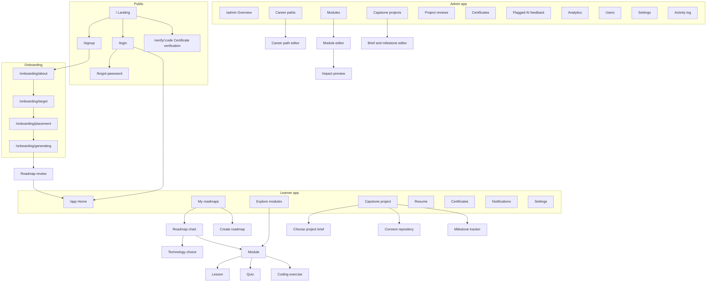
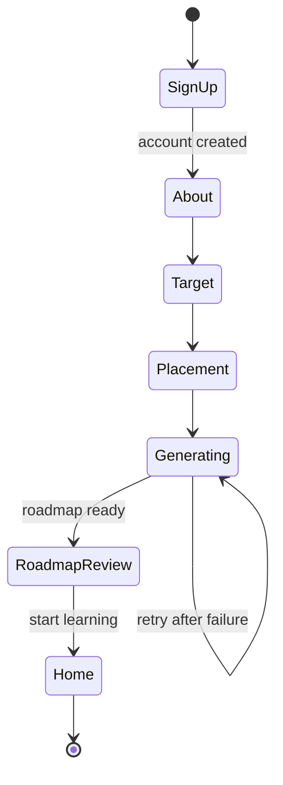

# First Commit: UI/UX Design Document

| | |
|---|---|
| **Related document** | project-proposal.md |
| **Frontend** | ReactJS with TypeScript |
| **Version** | 0.4 (draft) |
| **Date** | [Date] |

## Table of Contents

1. [Design Goals](#1-design-goals)
2. [Design Concept](#2-design-concept)
3. [Design Tokens](#3-design-tokens)
4. [Information Architecture](#4-information-architecture)
5. [Learner Screens](#5-learner-screens)
6. [Admin Screens](#6-admin-screens)
7. [Components](#7-components)
8. [Status System](#8-status-system)
9. [Writing Guidelines](#9-writing-guidelines)
10. [Motion](#10-motion)
11. [Responsive Behavior](#11-responsive-behavior)
12. [Accessibility](#12-accessibility)
13. [Frontend Implementation](#13-frontend-implementation)

---

# 1. Design Goals

First Commit's users are beginners, many of whom have never written code. The name reflects that moment: the first step toward a career in tech. The design has to lower anxiety, keep learners oriented, and make progress feel real.

| Goal | What it means in the interface |
|---|---|
| **Always show where the learner is** | The roadmap is reachable from every learning screen. The learner can always answer "what am I doing, and what's next?" |
| **Make progress verifiable** | Passed assessments look different from viewed content. Verified skills are marked consistently everywhere, including the resume. |
| **Feedback teaches, not judges** | Failed tests and AI feedback use calm, specific language and point to the next step. Red is reserved for actual errors, not for the learner. |
| **Admins act with full information** | Every change that affects learners shows its impact before it is published. |
| **Honest AI** | AI-generated content is labeled, explains its reasoning briefly, and can be flagged as wrong. |
| **One layout that adapts** | Every screen responds to the available width automatically. There is no separate desktop or mobile mode for users to switch between. |

---

# 2. Design Concept

## 2.1 Roadmap Chart

The roadmap follows the familiar chart pattern popularized by roadmap.sh, which many aspiring developers already recognize: a vertical main path of topics from top to bottom, with related subtopics branching to the left and right. First Commit adopts this layout and interaction pattern while using its own visual identity (Section 3).

The chart reflects First Commit's layered career paths (see the proposal, Section 3):

- **Core skill nodes** sit on the main path first (HTML, CSS, JavaScript, Git). Every learner in the role has them.
- **Module nodes** branch off each skill node.
- **A decision node** marks where the learner chooses a technology option (e.g., React or Vue). Nodes after it stay locked until the learner chooses.
- **Concept and technology skill nodes** continue the main path after the decision. Technology module nodes carry a small technology badge.
- **Reinforcement and challenge modules** appear as smaller branch nodes when the Roadmap AI adds them.
- **Milestone nodes** at the end show the Certificate of Completion, then the capstone project and Project Certificate.
- **Solid connectors** link nodes on the main path. **Dashed connectors** link branches.
- **Selecting any node** opens a side panel with details and actions.

```
                    ┌──────────────────────────┐
                    │  Junior Web Developer    │
                    │  Frontend track          │
                    │  6 of 16 modules passed  │
                    │  ███████░░░░░░░░░░░░░    │
                    └────────────┬─────────────┘
                                 │
 ┌─────────────────┐     ┌───────┴───────┐     ┌─────────────────┐
 │✓ HTML basics    │- - -│     HTML      │- - -│✓ Forms and      │
 └─────────────────┘     └───────┬───────┘     │  semantics      │
                                 │             └─────────────────┘
                         ┌───────┴───────┐     ┌─────────────────┐
                         │      CSS      │- - -│✓ CSS basics     │
                         └───────┬───────┘     └─────────────────┘
                                 │
 ┌─────────────────┐     ┌───────┴───────┐     ┌─────────────────┐
 │✓ JS basics      │- - -│  JavaScript   │- - -│◉ Arrays and     │
 └─────────────────┘     └───────┬───────┘     │  objects        │
          ┊                      │             │  You are here   │
 ┌ ─ ─ ─ ─ ─ ─ ─ ─ ┐             │             └─────────────────┘
   + Practice:                   │
 │ loops           │             │
 └ ─ ─ ─ ─ ─ ─ ─ ─ ┘     ┌───────┴───────┐     ┌─────────────────┐
                         │      Git      │- - -│○ Git basics     │
                         └───────┬───────┘     │ Also in: Data   │
                                 │             └─────────────────┘
                        ╔════════╧════════╗
                        ║ Choose your     ║
                        ║ framework       ║
                        ║ React or Vue    ║
                        ╚════════╤════════╝
                                 │
 ┌─────────────────┐     ┌───────┴───────┐     ┌─────────────────┐
 │🔒 What are      │- - -│  Components   │- - -│🔒 Components in │
 │  components     │     │  (concept)    │     │  [framework]    │
 └─────────────────┘     └───────┬───────┘     └─────────────────┘
                                 │
                                ...
                                 │
                    ┌────────────┴─────────────┐
                    │ 🏅 Certificate of         │
                    │    Completion            │
                    └────────────┬─────────────┘
                                 │
                    ┌────────────┴─────────────┐
                    │ 🛠 Capstone project       │
                    │    5 milestones          │
                    └────────────┬─────────────┘
                                 │
                    ┌────────────┴─────────────┐
                    │ 🏅 Project Certificate    │
                    └──────────────────────────┘
```

## 2.2 How First Commit Differs from a Static Roadmap

| Static roadmap chart | First Commit roadmap |
|---|---|
| Same chart for everyone | Shared core, then a track, technology, and adaptive modules chosen for each learner |
| Learners mark topics done themselves | Modules are marked passed only after passing the assessment, or tested out |
| "Pick one" branches are informational | The decision node asks the learner to choose, with a comparison, taster lessons, and an AI recommendation |
| Links to external resources | Opens First Commit modules with lessons, quizzes, and coding exercises |
| Ends at the last topic | Ends with a certificate, a capstone project, and a Project Certificate |
| Chart does not change after updates | Update notices appear on nodes when admins publish new module versions |

## 2.3 Visual Personality

- **Clear over clever.** A beginner should never wonder whether something is a button, a label, or decoration.
- **Tool-like where code appears.** Code editors, test results, and feedback use a monospace face and a developer-tool layout, so learners get comfortable with the environment they will work in.
- **Calm surfaces.** Borders and background shifts separate regions; shadows are used only for elements that float (menus, dialogs, side panels, toasts).
- **Ink is the frame and the figure, never the page.** The learner bar is ink, and so is the card naming the module you are on. Everything else is white, violet, or the wash. A screen gets at most one ink surface inside its content, and it goes to the thing being worked on.
- **The roadmap is the signature element.** Everything around it stays quiet.

---

# 3. Design Tokens

All tokens are defined as CSS custom properties and mirrored in a TypeScript tokens file (Section 13.4). The system comes from the First Commit design system; its provenance, substitutions, and the corrections applied to it are recorded in [design-source.md](design-source.md).

**The one-sentence version:** a light violet page carrying a mosaic of flat rounded panels — white, soft violet, and near-black — where a single acid lime is the only loud colour.

## 3.1 Color

Three families plus neutrals. **Violet** is the ground: the page wash, the hero gradient, soft cards, secondary buttons, and the focus ring. **Lime** is the accent and is rationed — one lime element per panel, and only one lime *button* per panel. **Ink** is both the primary type colour and the dark-panel fill.

### Lime — the single loud accent

| Token | Hex | Use |
|---|---|---|
| `--lime-400` | `#CDE84B` | `--accent`: primary button fills, the accent phrase on ink |
| `--lime-500` | `#C8E441` | Hover fill, progress fill |
| `--lime-600` | `#A9C42A` | Press fill |
| `--lime-700` | `#7F941C` | Reserved |
| `--lime-800` | `#6B7D18` | `--border-accent`: the 1px edge on a lime fill |

### Violet — the ground and secondary

| Token | Hex | Use |
|---|---|---|
| `--violet-100` | `#EDE5FB` | Soft cards, the AI panel tint |
| `--violet-200` | `#DCD0F7` | Badge fill |
| `--violet-300` | `#C8B6E5` | `--accent-soft`: secondary buttons |
| `--violet-500` | `#8B6BE0` | Selected radio, focused input border |
| `--violet-600` | `#6F4FD1` | `--focus-ring`, links |
| `--violet-700` | `#553AA6` | `--text-accent`: the accent phrase on light surfaces; `--ai` |

### Ink and neutrals

| Token | Hex | Use |
|---|---|---|
| `--ink-900` | `#14161D` | `--text-strong`, dark panel fill |
| `--ink-700` | `#22242D` | Dark button hover |
| `--gray-0` | `#FFFFFF` | `--surface-card` |
| `--gray-100` | `#F4F2F9` | `--surface-inset` |
| `--gray-200` | `#EEEAF8` | `--surface-page` |
| `--gray-300` | `#E3DDEF` | `--border-subtle`, progress track |
| `--gray-500` | `#9A93AB` | `--text-faint` |
| `--gray-600` | `#6B6878` | `--text-muted` |
| `--gray-700` | `#4A4857` | `--text-body` |

### Status colours

Each status has a **text** value that clears 4.5:1 on light surfaces and a **tint** it sits on. The lighter `--*-fill` values are for icons and fills only.

| Token | Text | Tint | Use |
|---|---|---|---|
| `--here` | `#8A6100` | `#FDF1C7` | Current module — "You are here" |
| `--verified` | `#237045` | `#E2F1E7` | Passed or tested out, verified skills |
| `--error` | `#C0392B` | `#FBE7E4` | Failed tests, validation errors, destructive actions |
| `--notice` | `#8A5A00` | `#FBF0DC` | Update notices, warnings |
| `--info` | `#2B6394` | `#E4EEF7` | Informational banners |
| `--ai` | `#553AA6` | `#EDE5FB` | AI-generated content label and flag controls |

### Career path colours

Used for path badges, "Also in" tags, and roadmap header accents.

| Token | Hex | Example assignment |
|---|---|---|
| `path-1` | `#553AA6` | Junior Web Developer |
| `path-2` | `#2B6394` | [Second career path] |
| `path-3` | `#8A5A00` | Future path |
| `path-4` | `#237045` | Future path |

### Colour rules

- **Lime is a fill colour, and a text colour only on ink.** It is never text on a light surface. Measured against white, `--lime-600` is **1.98:1** and even `--lime-700` only **3.11:1**, both below the 4.5:1 that Section 12 commits to. On ink, `--lime-400` is **13.1:1** and reads perfectly.
- **The accent phrase follows its surface.** The design's signature move is one highlighted phrase per headline: `--text-accent` (violet-700, **8.26:1** on white) on light panels, `--text-accent-on-dark` (lime-400) on ink panels. Never more than one phrase.
- **A lime fill carries a 1px `--border-accent` edge.** Lime on the page measures 1.38:1, so the fill alone does not give the control a 3:1 boundary (WCAG 2.2 SC 1.4.11). The edge does, at 3.88:1.
- **Controls use `--border-control` (`#847C93`), not `--border-subtle`.** The border of an input, an unchecked box, a radio, or an outline button is the only thing identifying that control, so it needs 3:1. `--border-subtle` (1.32:1 on white) is for decorative rules — table rows, dividers, a white card on white — where nothing depends on it.
- **Status is never shown by colour alone**; every status also has an icon and text (Section 8).
- `--error` marks the code or input that failed, never the learner's overall progress.
- There is no second brand hue and no third accent.

## 3.2 Typography

One family does everything, with a monospace for machine values.

| Role | Typeface | Reason |
|---|---|---|
| Interface and lessons | **Plus Jakarta Sans** | A geometric grotesque with a tall x-height and low contrast. Its 800 weight holds up at display sizes under tight tracking, which is what makes the stacked headline blocks work. |
| Code, test output, editor, durations | **JetBrains Mono** | Clear distinction between similar characters, readable at small sizes, and open apertures. Used for anything that reads as a machine value — code, timings, commit IDs, token names. |

Both are Google Fonts substitutions rather than supplied brand faces; see [design-source.md](design-source.md).

### Type Scale

| Token | Size | Weight | Use |
|---|---|---|---|
| `--text-display-1` | 64px | 800 | Landing hero only |
| `--text-display-2` | 52px | 800 | Large headlines |
| `--text-display-3` | 40px | 800 | Onboarding headlines |
| `--text-h1` | 32px | 800 | Page titles |
| `--text-h2` | 26px | 800 | Section titles |
| `--text-h3` | 21px | 700 | Panel titles, skill nodes |
| `--text-h4` | 17px | 700 | Card titles |
| `--text-body-lg` | 17px | 400 | Lead paragraphs |
| `--text-body-base` | 15px | 400 | Lessons, descriptions, module nodes |
| `--text-body-sm` | 13.5px | 400 | Helper text, node status text |
| `--text-caption` | 12px | 600 | Labels, badges |
| `--text-micro` | 10.5px | 700 | Eyebrows, code block headers |

Line heights: `--lh-display` 1.02, `--lh-heading` 1.18, `--lh-body` 1.55, `--lh-tight` 1.3. Tracking: `--ls-display` −3.5%, `--ls-heading` −2%, `--ls-body` −0.5%, `--ls-caps` +12%.

Headings use sentence case. ALL CAPS is for micro eyebrows only ("CONTINUE", "YOUR ROADMAP"), always with `--ls-caps`. Lesson text is limited to about 70 characters per line. Display sizes step down one level below 640px.

> **One name collision to avoid.** The source system defined `--text-body` twice — as a colour in `colors.css` and as `15px` in `typography.css` — so whichever loaded last won and `color: var(--text-body)` silently resolved to a length. Here the size is `--text-body-base` and `--text-body` is the colour.

## 3.3 Spacing and Layout

- Base unit: **4px**. Steps: 4, 8, 12, 16, 20, 24, 32, 40, 48, 64, 80, 104.
- **Panels tile on a 12px gutter (`--gutter-card`) with 24px padding inside them (`--pad-card`).** The page is a mosaic, not a stack of full-bleed bands: every section is a rounded panel with the page wash visible around it.
- Panels are mostly asymmetric two-ups, about 1.35:1 or 1.75:1.
- Container: 1180px (`--container`); narrow container 760px; lesson reading column 720px.
- All text is left-aligned, except roadmap node labels (centred within nodes) and empty states.

## 3.4 Shape and Elevation

Radii nest: a 14px thumbnail inside a 20px card inside a 28px panel.

| Element | Token | Radius |
|---|---|---|
| Section panels | `--radius-panel` | 28px |
| Cards | `--radius-card` | 20px |
| Tiles and thumbnails inside a card | `--radius-md` | 14px |
| Inputs, selects | `--radius-control` | 12px |
| List rows | `--radius-sm` | 10px |
| Checkboxes | `--radius-xs` | 6px |
| Buttons, badges, tags, progress tracks, search | `--radius-button` / `--radius-pill` | full pill |

**Inputs are never pills** — that shape is reserved for actions. The one exception is the search field, which the source system shapes as a pill.

| Elevation | Token | Use |
|---|---|---|
| Flat | — | Cards and panels at rest. Separation comes from surface colour against the page wash. |
| Hairline | 1px `--border-subtle` | Only when a white card sits on white |
| Resting button | `--shadow-xs` | Primary button |
| Raised | `--shadow-md` | Hovered card, menus, side panel, toasts |
| Floating | `--shadow-lg` | Dialogs, hero imagery |
| Glow | `--glow-lime` | Reserved for at most two moments per screen |

Cards lift **−3px** and gain `--shadow-md` on hover. Depth is reserved for interaction; nothing is elevated at rest.

---

# 4. Information Architecture

## 4.1 Sitemap



## 4.2 Navigation

Navigation adapts automatically to the screen width (see Section 11). Public pages, the sign-up and log-in pages, and onboarding pages show no app navigation at all, so nothing in the interface hints at pages the person cannot open yet (Section 4.3).

**Learner**

Navigation is **two levels**: three tabs in the top bar, and the tab's destinations in a
sidebar panel below it.

| Tab | Sidebar |
|---|---|
| **Home** | *(none — Home has nowhere else to go, so no panel is drawn)* |
| **Study** | My roadmaps, Explore modules, Capstone |
| **Career** | Resume, Certificates |

| Width | Navigation |
|---|---|
| ≥ 640px | The three tabs in the ink bar; the active tab's sidebar panel beside the content. Notifications bell and profile menu (with Profile information and Account settings) at the end of the bar. |
| < 640px | One level only: a bottom bar with Home, Roadmaps, Capstone, Resume, and More. More opens Explore modules, Certificates, and Settings. Two rows of navigation above a 320px viewport leaves nothing for the content. |

The Capstone item shows a lock icon and "Finish your roadmap to unlock" until the Certificate of Completion is earned. Learners can still open it to preview the project briefs.

**The bar is an ink pill, not a band.** Everything on a learner screen is a rounded panel on the page wash (Section 3.3), and the bar is no exception. It carries the wordmark with its lime accent word, the tabs, the bell, and a profile button whose avatar is a lime disc with the learner's initials. The active tab is a **lime fill with ink on it**; the active sidebar item is a violet tint. The sidebar itself is a white panel, headed by the tab's name as a micro eyebrow, and it follows the learner down long pages.

Module, quiz, exercise, and the technology choice have no navigation item of their own. They are opened *from* a roadmap, so they keep **Study** lit and the Study panel in place rather than leaving the learner looking at unlit navigation.

**Admin**

Left sidebar grouped by purpose:
- **Content:** Career paths, Modules, Capstone projects
- **Quality:** Project reviews, Flagged AI feedback, Analytics
- **Platform:** Certificates, Users, Settings, Activity log

Overview sits above the groups. The admin app shows a persistent "Admin" indicator in the top bar.

## 4.3 Route Map and Access Control

The platform is three separate areas. A learner never sees admin screens, and an admin never sees learner screens, because the areas have separate addresses, separate layouts, and separate code.

| Area | Routes | Who can open it | Layout |
|---|---|---|---|
| **Public** | `/`, `/signup`, `/login`, `/forgot-password`, `/reset-password`, `/verify/:code` | Anyone, signed in or not | Plain page, no app navigation |
| **Onboarding** | `/onboarding/about`, `/target`, `/placement`, `/generating` | Signed-in learners who have not finished onboarding | Step indicator only, no app navigation |
| **Learner app** | `/app`, `/app/roadmaps`, `/app/roadmap/:id`, `/app/roadmap/:id/technology/:decisionId`, `/app/module/:id`, `/app/quiz/:id`, `/app/exercise/:id`, `/app/explore`, `/app/capstone`, `/app/certificates`, `/app/resume`, `/app/notifications`, `/app/settings` | Signed-in learners who finished onboarding | Learner shell: sidebar or bottom navigation |
| **Admin app** | `/admin`, `/admin/paths`, `/admin/modules`, `/admin/briefs`, `/admin/reviews`, `/admin/certificates`, `/admin/flags`, `/admin/analytics`, `/admin/users`, `/admin/settings`, `/admin/log` | Signed-in admins only | Admin shell: grouped sidebar and "Admin" indicator |

**Two of those addresses are new.** §5.8's technology choice is nested under the roadmap —
`/app/roadmap/:id/technology/:decisionId` — because the *answer* belongs to a roadmap, not
to the track: `roadmap_technology_choices` is keyed on both, so the same decision on two of
a learner's roadmaps is two separate choices. §5.10's quiz is `/app/quiz/:id`, keyed by
assessment, because a module version can carry more than one.

### Redirect Rules

| Who | Opens | Result |
|---|---|---|
| Signed out | Any `/app` or `/admin` page | Sent to `/login`, and back to that page after logging in |
| Signed-in learner | `/admin/...` | Sent to `/app` with the message "That page isn't available for your account." |
| Signed-in learner, onboarding unfinished | Any `/app` page | Sent to their current onboarding step |
| Signed-in learner, onboarding finished | Any `/onboarding` page | Sent to `/app` |
| Admin | `/app/...` or `/onboarding/...` | Sent to `/admin` |
| Anyone signed in | `/login` or `/signup` | Sent to their own area — `/admin`, their unfinished onboarding step, or `/app`. Password reset stays reachable: §5.3's reset clears every session, so someone using it has a reason to. |

### Rules That Keep the Areas Apart

- **No shared shell.** The learner shell and the admin shell are different components. Neither renders the other's navigation, so admin items cannot appear in a learner's sidebar.
- **No cross links.** Learner pages contain no links to `/admin`, and admin pages contain no links to `/app`. An admin who also wants to learn uses a separate learner account.
- **Admin code is loaded only for admins.** The admin area is a separate lazily loaded bundle, so a learner's browser never downloads admin screens (Section 13.6).
- **The interface is not the protection.** Hiding a page only tidies the experience. What actually protects data is the backend: the browser never reaches the database, and every API endpoint resolves the session to a user and filters by that user's id, so typing the address by hand or calling the API directly returns nothing the account is not allowed to read (see database-schema.md, Section 6).
- **Role comes from the server.** The app reads the role from the signed-in user's profile, never from something the browser can set. On log out, cached data is cleared so the next person on the same computer sees nothing.
- **One role per account.** An account is either a learner or an admin. There is no role switcher in the interface.

---

---

# 5. Learner Screens

Wireframes show the wide layout first. Section 11.3 shows how key screens reflow on narrow screens. Each screen lists its **purpose** (the one job of the page) and the **actions** the learner can take.

## 5.1 Landing

**Purpose:** Show what First Commit does and get the visitor to sign up.

The hero shows the product's most characteristic element: a roadmap chart that draws itself from the first skill down to "Project Certificate", so visitors see the whole journey immediately.

```
┌─────────────────────────────────────────────────────────────┐
│  First Commit                         [ Log in ] [ Sign up ]│
├─────────────────────────────────────────────────────────────┤
│                                                             │
│  From your first line of code         ┌─────────┐           │
│  to your first real project.          │  HTML   │           │
│                                       └────┬────┘           │
│  A roadmap built for you, feedback    ┌────┴────┐           │
│  on every exercise, and a project     │  CSS    │           │
│  on your own GitHub.                  └────┬────┘           │
│                                          ...                │
│  [ Build my roadmap ]                 ┌────┴────────┐       │
│                                       │ 🛠 Capstone  │       │
│                                       └─────────────┘       │
├─────────────────────────────────────────────────────────────┤
│  How it works                                               │
│  1 Tell us your goal   2 Learn and practice                 │
│  3 Build your project  4 Get a verified resume              │
├─────────────────────────────────────────────────────────────┤
│  Career paths: Junior Web Developer  [More coming]          │
├─────────────────────────────────────────────────────────────┤
│  Verify a certificate  [ Enter certificate ID ]             │
└─────────────────────────────────────────────────────────────┘
```

**Actions:** Build my roadmap (sign up), Log in, view career paths, verify a certificate.

The numbered "How it works" row is a real sequence, so numbering is appropriate here.

## 5.2 Sign Up

**Purpose:** Create an account. Nothing else.

Sign up, log in, and each onboarding question live on their own page with their own address. They are never combined into one screen, so the browser Back button, refresh, and a saved link all behave the way people expect.

```
┌───────────────────────────────────┐
│  First Commit                     │
│                                   │
│  Create your account              │
│                                   │
│  Full name                        │
│  [                              ] │
│  Use the name you want on your    │
│  certificates.                    │
│                                   │
│  Email                            │
│  [                              ] │
│                                   │
│  Password                         │
│  [                              ] │
│  At least 8 characters            │
│                                   │
│  ☐ I agree to the Privacy Notice  │
│    and Terms of Use               │
│                                   │
│  [ Create account ]               │
│                                   │
│  Already have an account? Log in  │
└───────────────────────────────────┘
```

**Route:** `/signup`
**Actions:** Create account, go to log in.

- On success, the learner lands on the first onboarding page (`/onboarding/about`).
- Errors appear under their own field, for example: "That email is already registered. Log in instead."
- This page has no sidebar, no bottom navigation, and no links into the app.

## 5.3 Log In and Password Reset

**Purpose:** Return to the platform.

```
┌───────────────────────────────────┐
│  First Commit                     │
│                                   │
│  Log in                           │
│                                   │
│  Email                            │
│  [                              ] │
│  Password                         │
│  [                              ] │
│                    Forgot password│
│                                   │
│  [ Log in ]                       │
│                                   │
│  New here? Create an account      │
└───────────────────────────────────┘
```

**Routes:** `/login`, `/forgot-password`, `/reset-password`
**Actions:** Log in, request a reset link, set a new password, go to sign up.

**Where people land after logging in**

| Situation | Destination |
|---|---|
| Learner who finished onboarding | `/app` (Home) |
| Learner who never finished onboarding | The onboarding page they stopped at |
| Admin | `/admin` (Overview) |
| Anyone who was sent to log in from a protected page | Back to that page |

Failed logins say only: "Email or password is incorrect." Reset requests always say "If that email has an account, a reset link is on its way," so the page never reveals which emails are registered.

## 5.4 Onboarding

**Purpose:** Collect what the Roadmap AI needs, one question set per page.

Each step is its own page and its own address. Answers are saved when the learner continues, so closing the browser and returning later resumes at the same step rather than starting over.

| Step | Route | What the learner does |
|---|---|---|
| 1. About you | `/onboarding/about` | Answers 4 to 6 questions on experience, goals (company job, freelance), and weekly hours using radio groups and chips |
| 2. Target position | `/onboarding/target` | Chooses a career path |
| 3. Placement | `/onboarding/placement` | Rates what they already know per skill, then answers a check for anything rated "comfortable"; "I'm new to all of this" is always available; no time limit |
| 4. Generating | `/onboarding/generating` | Waits while the Roadmap AI runs, then moves on automatically |

```
┌─────────────────────────────────────────────────────────────┐
│  First Commit                                  Step 2 of 4  │
│  ●━━━━━━━●━━━━━━━○━━━━━━━○                                   │
│  About you  Target   Placement  Your roadmap                │
│                                                             │
│  What job are you working toward?                           │
│  You can add another roadmap later.                         │
│                                                             │
│  ┌───────────────────────────┐ ┌───────────────────────────┐│
│  │ Junior Web Developer      │ │ [More paths coming]       ││
│  │ Build websites and web    │ │                           ││
│  │ apps with HTML, CSS, JS   │ │                           ││
│  └───────────────────────────┘ └───────────────────────────┘│
│                                                             │
│  [ Back ]                                   [ Continue ]    │
└─────────────────────────────────────────────────────────────┘
```

Placement is introduced with: "This tells us what order to put your roadmap in, and what you could test out of straight away."

**What "skip" can actually mean.** A skipped module is one the roadmap leaves out — it is
**not** a pass, and no `module_completions` row is written from a placement result (the
backend rule in `database-schema.md` §6). Two consequences follow, and both are enforced
when the Roadmap AI's output is validated:

- A module **required for the certificate** can never be skipped, or the certificate would
  quietly become unreachable.
- A module **another roadmap module requires** can never be skipped, or that module would
  never unlock.

So placement narrows and orders the roadmap; the only thing that really removes a module
from a learner's path is **testing out of it**, which produces evidence. The copy should
promise no more than that.

**How placement works.** Two parts, on one page.

1. **Rate each skill** — New to me · I've seen it · I can use it with help · I'm comfortable with it. One control fills every row with "New to me", so the step is a single click for the person who most needs it to be. The skills asked about are the path's skills that have core modules, read from `path_skills` — so a second career path gets its placement questions without anyone writing a route.
2. **Check anything rated "comfortable."** A rating on its own clears nothing. Passing a skill's check writes `module_completions` with `method = 'tested_out'` for that skill's modules — the same evidence testing out of one module produces, counting the same toward the certificate.

| | |
|---|---|
| **Length** | About 2.5 questions per module a pass clears — five for a two-module skill, ten for a four-module one. Twenty-five in total for Junior Web Developer. |
| **Pass mark** | **80**, not the 70 a module quiz uses. One pass clears several modules at once, so it costs more to earn. |
| **Granularity** | All-or-nothing per skill. Splitting it per module would make each module worth two or three answers. |
| **Failing** | Nothing happens. The modules stay on the roadmap, and the per-module test-out — the longer, stronger assessment — is still there when the learner reaches them. There is no retake at onboarding, because that assessment is the retake. |
| **Questions** | Answerable by someone who learned the skill elsewhere. No question refers to a First Commit lesson or depends on a convention only this platform follows, and the seed loader rejects one that links to a lesson. |

Only "comfortable" triggers a check. Someone who can use a skill *with help* should do the module, and their answers do not clear it even if they give them.

**Rules for the onboarding flow**

- The step indicator shows progress but is not clickable for steps ahead; a learner cannot open `/onboarding/placement` before finishing the earlier steps and is sent back to the first unfinished step.
- **Back** returns to the previous step with the earlier answers still filled in.
- Onboarding pages show no app navigation. The only way out is finishing, or the profile menu's "Log out".
- The generating page explains what is happening ("Building your roadmap from your answers…") and what to do if it takes long ("This usually takes under a minute. You can leave this page; we'll email you when it's ready."). On failure it offers "Try again" and does not lose the learner's answers.
- After generation, the learner goes to roadmap review (Section 5.5), which is part of the app and shows navigation again.



## 5.5 Roadmap Review

**Purpose:** Let the learner check their generated roadmap before starting.

```
┌─────────────────────────────────────────────────────────────┐
│  Your Junior Web Developer roadmap                          │
│  16 modules, about 14 weeks at 6 hours a week               │
│                                                             │
│  ┌ AI ──────────────────────────────────────────────────┐   │
│  │ You passed the HTML placement questions, so those    │   │
│  │ modules are tested out. Since you want a company     │   │
│  │ job, I recommend the Frontend track. You'll choose   │   │
│  │ your framework after the core skills.                │   │
│  │                                      Is this wrong?  │   │
│  └──────────────────────────────────────────────────────┘   │
│                                                             │
│  Track  [ Frontend ▾ ]                                      │
│                                                             │
│  [Roadmap chart, Section 2.1]                               │
│                                                             │
│  [ Adjust weekly hours ]                  [ Start learning ]│
└─────────────────────────────────────────────────────────────┘
```

**Actions:** Review the chart, change the recommended track, adjust weekly hours, flag the AI explanation, start learning.

## 5.6 Home

**Purpose:** Show what to do next.

```
┌──────────┬──────────────────────────────────────────────────┐
│ Home     │  Good evening, [Name]                            │
│ Roadmaps │                                                  │
│ Explore  │  ┌ Continue ──────────────────────────────────┐  │
│ Capstone │  │ Arrays and objects, lesson 2 of 4          │  │
│ Resume   │  │                        [ Continue lesson ] │  │
│ Certific.│  └────────────────────────────────────────────┘  │
│          │                                                  │
│          │  ┌ Junior Web Developer ──────────────────────┐  │
│          │  │ 6 of 16 modules passed                     │  │
│          │  │ ███████░░░░░░░░░░░░░       [ View roadmap ]│  │
│          │  └────────────────────────────────────────────┘  │
│          │                                                  │
│          │  ┌ Updates ───────────────────────────────────┐  │
│          │  │ ⓘ We added a practice module on loops to   │  │
│          │  │   your roadmap after your last quiz.       │  │
│          │  │   [ View module ]  [ Remove ]              │  │
│          │  └────────────────────────────────────────────┘  │
└──────────┴──────────────────────────────────────────────────┘
```

**Actions:** Continue the current lesson or milestone, open the roadmap, respond to updates.

- **The hero is a violet gradient panel with an ink card inside it.** The greeting is its eyebrow, the headline is "Pick up where you left off." with the accent phrase on the second line, and the two actions sit below it: Continue lesson, then View roadmap as an outline. The ink card beside it names the current module, where the learner is in it, and the two counts — modules passed and remaining.
- **The accent phrase is violet, not lime.** The prototype sets it in lime, which measures 1.98:1 against this wash. Section 3.1's rule holds: lime is a fill, and text only on ink. The ink card's "CURRENT MODULE" eyebrow *is* lime, because there it is 13.1:1.
- **When nothing is waiting**, the hero keeps its shape and loses its first action: the lead sentence says everything available is done, and View roadmap becomes the primary.
- During the capstone, the Continue panel shows the current milestone instead of a lesson.
- **Empty state:** "Choose a target job to build your first roadmap." with "Build my roadmap".

## 5.7 Roadmap Chart

**Purpose:** Show progress and let the learner pick what to work on.

```
┌─────────────────────────────────────────────────────────────┐
│  Junior Web Developer, Frontend          [ Roadmap menu ▾ ] │
│  6 of 16 passed   ███████░░░░░░░░░░░░░                      │
│  Legend: ✓ Passed  ◉ Current  ○ Available  🔒 Locked         │
├───────────────────────────────────────┬─────────────────────┤
│                                       │ Arrays and objects  │
│        [Roadmap chart canvas]         │ ◉ In progress       │
│                                       │ Lesson 2 of 4       │
│   Zoom: [ − ] [ Fit ] [ + ]           │                     │
│                                       │ Store and work with │
│                                       │ lists and grouped   │
│                                       │ data.               │
│                                       │                     │
│                                       │ About 5 hours       │
│                                       │                     │
│                                       │ [ Continue module ] │
│                                       │ [ Test out ]        │
│                                       │                     │
│                                       │ Unlocks: Git basics │
└───────────────────────────────────────┴─────────────────────┘
```

**Actions:** Select nodes, continue or test out of modules, see unlock requirements, open the technology choice, open the capstone, use the roadmap menu (adjust weekly hours, change track, regenerate, archive).

**Side panel by node type**

| Node | Panel shows | Actions |
|---|---|---|
| Module | Description, status, progress, time estimate, what it unlocks | Continue, Start, Test out |
| Skill | Its modules and overall progress | Open a module |
| Locked module | What unlocks it | Go to required module |
| Reinforcement | Why it was added ("Added after two attempts on the arrays quiz") | Start, Remove |
| Challenge | Why it was offered | Start, Skip |
| Decision | The options and whether a choice was made | Choose technology (Section 5.8) |
| Certificate | Remaining required modules, or the earned certificate | View certificate |
| Capstone | Locked reason, or current milestone | Preview briefs, Open capstone |

Learners cannot mark modules as done manually.

## 5.8 Technology Choice

**Purpose:** Help the learner choose a framework with enough information to choose well.

Opens from the decision node, as a full page on all widths.

```
┌─────────────────────────────────────────────────────────────┐
│  Choose your framework                                      │
│  You've finished the core skills. Pick the framework your   │
│  Frontend modules and capstone will use. You can switch     │
│  later and keep your progress on shared modules.            │
│                                                             │
│  ┌ AI ──────────────────────────────────────────────────┐   │
│  │ React is a good fit: it appears in more junior job   │   │
│  │ postings, and you want a company job.                │   │
│  │                                      Is this wrong?  │   │
│  └──────────────────────────────────────────────────────┘   │
│                                                             │
│  ┌──────────────────────────┐  ┌──────────────────────────┐ │
│  │ React        Recommended │  │ Vue                      │ │
│  │                          │  │                          │ │
│  │ Build UIs from           │  │ Build UIs with templates │ │
│  │ JavaScript components.   │  │ close to HTML.           │ │
│  │                          │  │                          │ │
│  │ Learning curve: moderate │  │ Learning curve: gentler  │ │
│  │ Common in job postings   │  │ Popular for smaller      │ │
│  │                          │  │ teams and freelancers    │ │
│  │ [ Try taster lesson ]    │  │ [ Try taster lesson ]    │ │
│  │ [ Choose React ]         │  │ [ Choose Vue ]           │ │
│  └──────────────────────────┘  └──────────────────────────┘ │
└─────────────────────────────────────────────────────────────┘
```

**Actions:** Read the comparison, try a taster lesson for each option, choose a technology.

- **The recommended option takes the primary button; the others take secondary.** The recommendation is stated in words above the cards and labelled again on the card itself (Section 12), so the button weight agrees with what the screen already says rather than carrying the message alone. With no recommendation to show, every option is primary.
- Choosing shows a confirmation: "Your roadmap will use React. You can switch later from the roadmap menu."
- The taster lesson builds the same small counter in each framework and takes about 10 minutes.
- **Switching later** opens a dialog: "Switch to Vue? Your core and concept modules stay passed. Your 3 passed React modules stay on your resume. Vue modules replace React modules on your roadmap."

## 5.9 Module Page

**Purpose:** Teach the module's lessons in order.

```
┌─────────────────────────────────────────────────────────────┐
│  Back to roadmap                                            │
│  Components in React                        React badge     │
│                                                             │
│  ┌────────────────┐  ┌──────────────────────────────────┐   │
│  │ 1 Your first   │  │  Props                           │   │
│  │   component  ✓ │  │                                  │   │
│  │ 2 Props      ◉ │  │  [Lesson content, max 720px      │   │
│  │ 3 Lists      ○ │  │   reading column, with inline    │   │
│  │ ────────────── │  │   code and runnable examples]    │   │
│  │ Quiz         ○ │  │                                  │   │
│  │ Exercise     ○ │  │  [ Previous ]   [ Next lesson ]  │   │
│  └────────────────┘  └──────────────────────────────────┘   │
│                                                             │
│  Already know this? [ Take the assessment to test out ]     │
└─────────────────────────────────────────────────────────────┘
```

**Actions:** Read lessons, move between lessons, open the quiz or exercise, test out, read update notes.

**Three panels and a strip.** The header panel carries the back link, the title, the skill and estimate, and any technology or passed badge. An update notice sits below it as its own tile on the wash. Then the lesson rail and the reading panel, side by side from 640px. Below them a violet strip: "Already know this?" with the test-out action.

**The quiz is a row in the lesson list**, under a rule, with its question count beside it — the same shape as a lesson row, but it leaves the page. The exercise joins it when exercises are built.

The reading column is a `section`, not a second `main`: the learner shell already renders one, and a page with two main landmarks gives a screen reader none it can jump to reliably.

**Version notices**
- Completed, then updated: "ⓘ This module was updated after you passed it. Your credit stays. [ See what's new ]"
- Updated while in progress: "ⓘ A newer version of this module is available. You can finish your current version and keep your progress."

## 5.10 Quiz

**Purpose:** Check understanding of the module.

```
┌─────────────────────────────────────────────────────────────┐
│  Quiz: Components in React                   Question 3 of 8│
│  ███████████░░░░░░░░░                                       │
│                                                             │
│  What does a component receive through props?               │
│                                                             │
│  ○ Data passed from its parent component                    │
│  ○ Styles from the CSS file                                 │
│  ○ Data stored in the browser                               │
│  ○ I don't know yet                                         │
│                                                             │
│  [ Previous ]                                  [ Next ]     │
└─────────────────────────────────────────────────────────────┘
```

**Result: passed**

```
┌─────────────────────────────────────────────────────────────┐
│  ✓ You passed with 7 of 8 (88%)                             │
│  Components in React is now a verified skill.               │
│                                                             │
│  Review: Question 5, rendering lists                        │
│                                                             │
│  [ Review answers ]                    [ Next: Exercise ]   │
└─────────────────────────────────────────────────────────────┘
```

**Result: not passed**

```
┌─────────────────────────────────────────────────────────────┐
│  You got 4 of 8 (50%). You need 6 to pass.                  │
│                                                             │
│  Topics to review                                           │
│  Props             Lesson 2   [ Review lesson ]             │
│  Rendering lists   Lesson 3   [ Review lesson ]             │
│                                                             │
│  [ Review answers ]                        [ Retake quiz ]  │
└─────────────────────────────────────────────────────────────┘
```

**Actions:** Answer questions, move between questions, submit, review answers, review linked lessons, retake.

- **A pass is a green tick and a sentence, not a loud panel.** "You passed with 7 of 8 (88%)" beside a `--verified` check, on the same white panel every other state uses — icon, text, and colour, which is all Section 8 asks for. What the learner got right sits below it on the verified tint.
- **Not passing looks the same, minus the tick.** Section 3.1 keeps `--error` for the answer that failed and never for the learner's progress, so there is no red here. Topics to review are bordered rows, each naming the lesson it came from.
- No time limit. Answers are saved as the learner goes.
- After a second failed attempt, the Roadmap AI may add a reinforcement module, and the result screen says so.
- Correct answers are shown only for questions answered correctly, so retakes remain meaningful.

## 5.11 Coding Exercise and Feedback

**Purpose:** Practice writing code and learn from test results and feedback.

```
┌─────────────────────────────────────────────────────────────┐
│  Exercise: Sum of even numbers                  [ Hint ]    │
├──────────────────────────────┬──────────────────────────────┤
│  script.js                   │  Instructions │ Results      │
│ ┌──────────────────────────┐ │ ─────────────────────────────│
│ │1 function sumEven(nums) {│ │  3 of 4 tests passed         │
│ │2   let total = 0;        │ │                              │
│ │3   for (let i = 1; i <   │ │  ✓ Sums [2, 4, 6] to 12      │
│ │4     nums.length; i++) { │ │  ✓ Ignores odd numbers       │
│ │5     if (nums[i] % 2 ... │ │  ✓ Handles negative numbers  │
│ │6   ...                   │ │  ✕ Includes the first item   │
│ │                          │ │    Expected 2, got 0         │
│ └──────────────────────────┘ │                              │
│                              │  ┌ AI feedback ────────────┐ │
│                              │  │ Your loop starts at     │ │
│                              │  │ index 1, so the first   │ │
│                              │  │ number is never checked.│ │
│                              │  │ Look at line 3: where   │ │
│                              │  │ do arrays start in JS?  │ │
│                              │  │          Was this wrong?│ │
│                              │  └─────────────────────────┘ │
├──────────────────────────────┴──────────────────────────────┤
│  [ Reset code ]                    [ Run tests ]  [ Submit ]│
└─────────────────────────────────────────────────────────────┘
```

**Actions:** Write code, use hints, run tests, read feedback, reset, submit, flag feedback.

- React and Vue exercises show a file tabs row (e.g., `App.jsx`, `Counter.jsx`) and a live preview tab beside Results.
- Test results appear before AI feedback, because they are the source of truth.
- AI feedback gives a hint and a line reference, never the corrected code.
- While feedback generates: "Writing feedback on your test results…". If queued: "Feedback is queued. Your test results are ready below."
- When all tests pass: "All 4 tests passed. Module exercise complete." in `verified`.

## 5.12 My Roadmaps

**Purpose:** Switch between roadmaps and start new ones.

```
┌─────────────────────────────────────────────────────────────┐
│  My roadmaps                           [ Create roadmap ]   │
│                                                             │
│  ┌─────────────────────────────────────────────────────────┐│
│  │ Junior Web Developer, Frontend with React     Active    ││
│  │ 6 of 16 modules passed   ███████░░░░░░░░░               ││
│  │ Last studied today                  [ Open roadmap ]    ││
│  └─────────────────────────────────────────────────────────┘│
│                                                             │
│  ┌─────────────────────────────────────────────────────────┐│
│  │ [Second career path]                          Active    ││
│  │ 3 of 14 modules passed (3 shared)                       ││
│  │ Last studied 5 days ago             [ Open roadmap ]    ││
│  └─────────────────────────────────────────────────────────┘│
│                                                             │
│  Archived (1)                                        [ Show]│
└─────────────────────────────────────────────────────────────┘
```

**Actions:** Open a roadmap, create a roadmap, view archived roadmaps, restore an archived roadmap.

**Create roadmap** reuses the survey and target position steps. Before generating, it shows: "3 modules you've already passed count toward this roadmap: Git basics, HTML basics, CSS basics."

**Empty archived state:** hidden entirely when there are no archived roadmaps.

## 5.13 Explore Modules

**Purpose:** Find and take any published module, including ones outside the roadmap.

A searchable, filterable list. Filters: skill area, technology, status, and career path. Each row shows module name, skill, technology badge (if any), estimated time, status, and path badges.

**Actions:** Search, filter, open a module, add a module to a roadmap.

## 5.14 Capstone Project

**Purpose:** Guide the learner from an empty folder to a finished, tracked project.

The capstone has three stages, shown as a step indicator at the top of the page.

### Stage 1: Choose a Project Brief

```
┌─────────────────────────────────────────────────────────────┐
│  Capstone project                                           │
│  ●━━━━━━━━━━━━━━○━━━━━━━━━━━━━━○                             │
│  Choose brief   Connect repo   Build                        │
│                                                             │
│  Choose what you'll build with React.                       │
│                                                             │
│  ┌──────────────────────────┐  ┌──────────────────────────┐ │
│  │ Task tracker  Recommended│  │ Weather dashboard        │ │
│  │ Add, edit, filter, and   │  │ Search cities and show   │ │
│  │ save tasks.              │  │ forecasts from an API.   │ │
│  │                          │  │                          │ │
│  │ 5 milestones             │  │ 5 milestones             │ │
│  │ About 3 weeks            │  │ About 3 weeks            │ │
│  │ Uses: components, state, │  │ Uses: components, data   │ │
│  │ forms, local storage     │  │ fetching, error states   │ │
│  │                          │  │                          │ │
│  │ [ View brief ]           │  │ [ View brief ]           │ │
│  └──────────────────────────┘  └──────────────────────────┘ │
└─────────────────────────────────────────────────────────────┘
```

**Actions:** Read briefs, see the AI recommendation, choose a brief.

### Stage 2: Connect a Repository

```
┌─────────────────────────────────────────────────────────────┐
│  Connect your repository                                    │
│                                                             │
│  1  Create your repository from the starter template        │
│     [ Open React starter template on GitHub ]               │
│                                                             │
│  2  Clone it to your computer                               │
│     git clone https://github.com/you/task-tracker.git  [⧉]  │
│                                                             │
│  3  Give First Commit access to this repository             │
│     [ Connect with GitHub ]                                 │
│     Only the repository you select is shared.               │
│                                                             │
│  Status: ✓ Connected to you/task-tracker                    │
│                                                             │
│                                          [ Start building ] │
└─────────────────────────────────────────────────────────────┘
```

**Actions:** Open the starter template, copy the clone command, connect with GitHub, choose the repository.

- **No GitHub account:** "You need a GitHub account to track your project. [ Create one on GitHub ] Then return here." Linked to the Git module that covers this.

### Stage 3: Milestone Tracker

```
┌─────────────────────────────────────────────────────────────┐
│  Task tracker with React          you/task-tracker  [ ↗ ]   │
│  2 of 5 milestones complete   ████████░░░░░░░░░░░░          │
├──────────────────────────────┬──────────────────────────────┤
│  ✓ 1 Set up the repository   │  Milestone 3                 │
│  ✓ 2 Build the layout        │  Add and edit tasks          │
│  ◉ 3 Add and edit tasks      │                              │
│  ○ 4 Save tasks              │  Acceptance criteria         │
│  ○ 5 Deploy                  │  ☐ Users can add a task      │
│                              │  ☐ Users can edit a task     │
│                              │  ☐ Empty input is rejected   │
│                              │                              │
│                              │  Related modules             │
│                              │  State in React, Forms       │
│                              │                              │
│                              │  Latest push                 │
│                              │  a1b2c3d "Add task form"     │
│                              │  12 minutes ago              │
│                              │                              │
│                              │  Checks                      │
│                              │  ✓ TaskForm component exists │
│                              │  ✕ Test: rejects empty input │
│                              │                              │
│                              │  ┌ AI review ─────────────┐  │
│                              │  │ Adding and editing     │  │
│                              │  │ work. Your form still  │  │
│                              │  │ submits when the input │  │
│                              │  │ is empty. Look at the  │  │
│                              │  │ submit handler in      │  │
│                              │  │ TaskForm.jsx.          │  │
│                              │  │         Was this wrong?│  │
│                              │  └────────────────────────┘  │
│                              │                              │
│                              │  Push history (6 commits)    │
└──────────────────────────────┴──────────────────────────────┘
```

**Actions:** Read milestone criteria, open related modules, view the latest push, checks, and AI review, view push history, open the repository on GitHub, flag the AI review, answer an explanation question when asked.

- The page updates automatically when a new push arrives.
- Waiting state: "Push your changes to see checks for this milestone."
- Checks running: "Running checks on commit a1b2c3d…"
- **Explanation question** (shown after some milestones): "In a few sentences, explain how your submit handler prevents empty tasks." The answer is saved for admin review if the project is flagged.
- **Milestone 5 (Deploy)** asks for the live demo link, which is checked to confirm it loads.
- **Project complete:** "All 5 milestones complete. Your Project Certificate is ready, and this project is now on your resume. [ View certificate ]"

## 5.15 Certificates

**Purpose:** View, download, and share earned certificates.

```
┌─────────────────────────────────────────────────────────────┐
│  Certificates                                               │
│                                                             │
│  ┌─────────────────────────────────────────────────────────┐│
│  │ 🏅 Certificate of Completion                            ││
│  │ Junior Web Developer, Frontend track with React         ││
│  │ Issued September 2, 2026   ID FC-7K2M-94QX              ││
│  │ [ View ]  [ Download PDF ]  [ Copy verification link ]  ││
│  └─────────────────────────────────────────────────────────┘│
│                                                             │
│  ┌ ─ ─ ─ ─ ─ ─ ─ ─ ─ ─ ─ ─ ─ ─ ─ ─ ─ ─ ─ ─ ─ ─ ─ ─ ─ ─ ─ ┐│
│   🔒 Project Certificate                                    │
│  │ Complete your capstone project to earn this.            ││
│   2 of 5 milestones complete          [ Open capstone ]     │
│  └ ─ ─ ─ ─ ─ ─ ─ ─ ─ ─ ─ ─ ─ ─ ─ ─ ─ ─ ─ ─ ─ ─ ─ ─ ─ ─ ─ ┘│
└─────────────────────────────────────────────────────────────┘
```

**Actions:** View, download as PDF, copy the verification link, open the capstone for locked certificates.

**Empty state:** "Finish your roadmap to earn your first certificate." with "View roadmap".

### Public Certificate Verification Page

Accessible without logging in, via link or QR code.

```
┌─────────────────────────────────────────────────────────────┐
│  First Commit certificate verification                      │
│                                                             │
│  ✓ Valid certificate                                        │
│                                                             │
│  [Learner's full name]                                      │
│  Project Certificate                                        │
│  Junior Web Developer, Frontend track with React            │
│  Project: Task tracker                                      │
│  Issued September 20, 2026                                  │
│  Certificate ID FC-3PZ8-61LD                                │
│                                                             │
│  Skills verified: HTML, CSS, JavaScript, Git, React         │
│  Repository: github.com/you/task-tracker                    │
└─────────────────────────────────────────────────────────────┘
```

- Revoked certificates show "✕ This certificate was revoked on [date]" without the reason.
- Unknown IDs show "No certificate found with ID [ID]. Check the ID and try again."
- The page shows only the learner's name and certificate details, never contact information.

## 5.16 Resume

**Purpose:** Build an honest, ATS-friendly resume from verified evidence.

```
┌─────────────────────────────────────────────────────────────┐
│  Resume                                                     │
│  Tailor for  [ Junior Web Developer ▾ ]                     │
│                                                             │
│  ┌ Evidence ──────────────┐  ┌ Preview ──────────────────┐  │
│  │ Verified skills        │  │ [Name]                    │  │
│  │ ☑ HTML    ✓ passed     │  │ [Email] [Phone] [City]    │  │
│  │ ☑ CSS     ✓ passed     │  │                           │  │
│  │ ☑ JavaScript ✓ passed  │  │ Summary                   │  │
│  │ ☑ React   ✓ passed     │  │ ...                       │  │
│  │                        │  │ Skills                    │  │
│  │ Certifications         │  │ HTML, CSS, JavaScript,    │  │
│  │ ☑ Certificate of       │  │ Git, React                │  │
│  │   Completion           │  │                           │  │
│  │                        │  │ Certifications            │  │
│  │ Projects               │  │ Certificate of Completion │  │
│  │ Build your capstone    │  │ ...                       │  │
│  │ project to add it      │  │                           │  │
│  │ here. [ Open capstone ]│  │ Education                 │  │
│  │                        │  │ ...                       │  │
│  │ Personal details       │  │                           │  │
│  │ [ Edit details ]       │  │                           │  │
│  └────────────────────────┘  └───────────────────────────┘  │
│                                                             │
│  [ Generate resume ]                     [ Download PDF ]   │
└─────────────────────────────────────────────────────────────┘
```

**Actions:** Choose the target path, select evidence, edit personal details and education, generate, edit AI-written text, download PDF.

- The evidence panel lists only verified items; learners choose which to include but cannot add unverified skills.
- Completed capstones appear under Projects with the repository link, live demo link, and technology.
- The preview uses an ATS-friendly layout: single column, standard headings, no tables, icons, or images.
- AI-written summary and project descriptions are labeled and editable.
- With no verified skills yet: "Pass your first module assessment to add a verified skill to your resume."

## 5.17 Notifications

**Purpose:** Keep the learner informed and let them act on updates.

A list grouped by Today, This week, and Earlier. Types include module updates, new modules in a career path, reinforcement or challenge modules added, milestone checks finished, certificates earned, and account notices.

**Actions:** Open the related item, act inline where possible (e.g., "Add to roadmap"), mark as read, mark all as read.

**Empty state:** "You're all caught up."

## 5.18 Settings

**Purpose:** Manage the account.

| Section | Actions |
|---|---|
| Profile | Edit full name (with note that it appears on new certificates), email, and education details used on the resume |
| Password | Change password |
| GitHub | View connected account and repositories, disconnect |
| Notifications | Choose which notifications to receive by email |
| Data and account | Download my data, delete my account |

**Delete account dialog:** "Delete your account? Your roadmaps, progress, resumes, and certificates will be permanently deleted, and your certificate verification links will stop working. This can't be undone." Buttons: "Cancel" and "Delete my account".

---

# 6. Admin Screens

Admins keep the learning content accurate and the learner evidence trustworthy. Admins cannot mark modules as passed or edit scores; corrections are logged overrides with a reason.

## 6.1 Overview

**Purpose:** Show what needs attention today.

```
┌─────────────────────────────────────────────────────────────┐
│  Overview                                            Admin  │
│                                                             │
│  ┌ Needs review ──────────────┐ ┌ Content ────────────────┐ │
│  │ 7 flagged AI feedback      │ │ 3 drafts not published  │ │
│  │ 2 flagged projects         │ │ 1 brief missing Vue     │ │
│  │ [ Review ]                 │ │   starter template      │ │
│  └────────────────────────────┘ └─────────────────────────┘ │
│                                                             │
│  ┌ Learners struggling ─────────────────────────────────────┐│
│  │ Arrays and objects     41% pass rate    [ View module ] ││
│  │ Milestone 4: Save tasks  38% stuck      [ View brief ]  ││
│  └──────────────────────────────────────────────────────────┘│
│                                                             │
│  Active learners 214   Certificates this month 18           │
└─────────────────────────────────────────────────────────────┘
```

**Actions:** Open any item to handle it on its own page.

## 6.2 Career Path Editor

**Purpose:** Define the layered structure the Roadmap AI selects from.

```
┌─────────────────────────────────────────────────────────────┐
│  Career path: Junior Web Developer     Draft   [ Publish ]  │
│  Core │ Tracks │ Certificate rules                          │
├──────────────────┬──────────────────────────────────────────┤
│  Library         │  Track: Frontend                         │
│  [ Search ]      │  Options: [React] [Vue] [+ Add option]   │
│                  │                                          │
│  Skills          │            ┌───────────┐                 │
│  ▢ Components    │  ┌───────┐ │Components │ ┌───────────┐   │
│  ▢ State         │  │What   │-│ (concept) │-│Components │   │
│  ▢ Routing       │  │are... │ └─────┬─────┘ │ in React  │   │
│                  │  └───────┘       │       │ ───────── │   │
│  Modules         │                  │       │Components │   │
│  ▢ concept       │            ┌─────┴─────┐ │ in Vue    │   │
│  ▢ React         │            │   State   │ └───────────┘   │
│  ▢ Vue           │            └───────────┘                 │
│  ▢ reinforcement │                                          │
│  ▢ challenge     │  Showing: [ All options ▾ ]              │
└──────────────────┴──────────────────────────────────────────┘
```

| Tab | Actions |
|---|---|
| **Core** | Place core skills on the main path, attach core modules, set prerequisites |
| **Tracks** | Create tracks with a description the AI uses for matching; add technology options and their prerequisites; place concept skills; attach concept modules and technology modules per option; attach reinforcement and challenge modules to skills; link capstone briefs |
| **Certificate rules** | Choose which modules are required for the Certificate of Completion |

- The "Showing" filter previews the path as a learner who chose a specific option would see it.
- Validation blocks circular prerequisites ("This connection creates a loop: …") and warns when a technology option is missing a technology module for any concept skill ("Vue has no module for State.").
- Unfinished options can stay unpublished while the rest of the path is live.

## 6.3 Module Editor

**Purpose:** Write and maintain module content.

```
┌─────────────────────────────────────────────────────────────┐
│  Components in React             Kind: technology (React)   │
│  Version 3 (draft)       Published: version 2               │
│                                                             │
│  Content │ Assessment │ Test cases │ Rubric │ History       │
│  ───────────────────────────────────────────────────────────│
│  [Rich text and code block editor]                          │
│                                                             │
├─────────────────────────────────────────────────────────────┤
│  [ Discard draft ]      [ Preview as learner ]  [ Publish ] │
└─────────────────────────────────────────────────────────────┘
```

**Actions:** Set module kind (core, concept, technology, reinforcement, challenge); write lessons; create quizzes and exercises; write test cases and run them against the reference solution; write the rubric; preview; publish as minor edit or major revision; view history; archive.

- Publishing is blocked if the reference solution fails any test.
- Test cases can be marked visible or hidden from learners.

## 6.4 Impact Preview Dialog

Shown before any major revision, path change, or removal.

```
┌─────────────────────────────────────────────────┐
│  Publish version 3 of Components in React?      │
│                                                 │
│  98   active roadmaps include this module       │
│  12   learners are taking version 2 now         │
│  156  learners have passed it                   │
│                                                 │
│  Learners taking version 2 will finish it.      │
│  Learners who passed keep their credit.         │
│  New learners get version 3.                    │
│                                                 │
│  [ Cancel ]                [ Publish version 3 ]│
└─────────────────────────────────────────────────┘
```

Toast after publishing: "Version 3 of Components in React published."

## 6.5 Capstone Projects

**Purpose:** Set up project briefs learners build after their roadmap.

```
┌─────────────────────────────────────────────────────────────┐
│  Brief: Task tracker            Track: Frontend   Draft     │
│  Brief │ Milestones │ Templates │ History                   │
├──────────────────────┬──────────────────────────────────────┤
│  1 Set up repository │  Milestone 3: Add and edit tasks     │
│  2 Build the layout  │                                      │
│  3 Add and edit  ◉   │  Acceptance criteria                 │
│  4 Save tasks        │  [ + Add criterion ]                 │
│  5 Deploy            │                                      │
│  [ + Add milestone ] │  Linked modules                      │
│                      │  [State] [Forms] [ + Link module ]   │
│                      │                                      │
│                      │  Automatic checks                    │
│                      │  File exists: TaskForm component     │
│                      │  Workflow test: rejects empty input  │
│                      │  [ + Add check ]                     │
│                      │                                      │
│                      │  AI review checklist                 │
│                      │  [ Checklist editor ]                │
│                      │                                      │
│                      │  Explanation question (optional)     │
│                      │  [                                 ] │
├──────────────────────┴──────────────────────────────────────┤
│  [ Preview as learner ]                        [ Publish ]  │
└─────────────────────────────────────────────────────────────┘
```

| Tab | Actions |
|---|---|
| **Brief** | Write title, description, goals, skills applied, estimated time |
| **Milestones** | Add and order milestones; write acceptance criteria; link modules; configure checks (file exists, workflow test, deployment link loads); write the AI review checklist; add explanation questions |
| **Templates** | Link a starter template repository per technology option; the brief cannot be published for an option without one |
| **History** | View versions; briefs follow the same versioning rules as modules |

## 6.6 Project Reviews

**Purpose:** Monitor capstone projects and handle integrity concerns fairly.

```
┌─────────────────────────────────────────────────────────────┐
│  Project reviews        [ Flagged (2) ] [ All projects ]    │
├──────────────────────┬──────────────────────────────────────┤
│ ⚑ [Learner name]     │  Task tracker with React             │
│   Task tracker       │  you/task-tracker  [ Open on GitHub ]│
│   Most work in one   │                                      │
│   commit             │  Flag: 94% of code added in 1 commit │
│                      │                                      │
│ ⚑ [Learner name]     │  Commit timeline                     │
│   Weather dashboard  │  ▁▁▁▁▁▁▁▁▁█  (10 days)                │
│   Similar to another │                                      │
│   project            │  Milestones: 5 of 5, checks passed   │
│                      │                                      │
│                      │  Explanation answers                 │
│                      │  Milestone 3: "[learner's answer]"   │
│                      │                                      │
│                      │  Decision                            │
│                      │  [ Clear flag ]                      │
│                      │  [ Request explanation ]             │
│                      │  [ Request milestone redo ]          │
│                      │  [ Reject project ]                  │
│                      │  Reason (required) [               ] │
└──────────────────────┴──────────────────────────────────────┘
```

**Actions:** Review flagged projects, view repositories, commit timelines, check results, and explanation answers; clear flags; request explanations or redos; reject projects; override an incorrect check with a reason.

- The "All projects" view lists every project with status and current milestone.
- Similarity flags show both projects side by side.
- Rejecting a project revokes its Project Certificate and notifies the learner with the reason.
- All decisions require a reason and are recorded in the activity log.

## 6.7 Certificates

**Purpose:** Manage certificate templates and issued certificates.

| Area | Actions |
|---|---|
| **Templates** | Edit layout and wording for the Certificate of Completion and Project Certificate; preview with sample data |
| **Issued** | Search by learner name or certificate ID; filter by type and status; open the public verification page |
| **Revoke** | Revoke with a required reason; the verification page shows the certificate as revoked |
| **Reissue** | Reissue with corrected details (e.g., misspelled name); the old ID redirects to the new certificate |

Certificates are issued automatically when requirements are met; there is no manual issue button.

## 6.8 Flagged AI Feedback

**Purpose:** Keep the AI accurate across exercises, milestones, roadmaps, and resumes.

A list of flags filtered by source (exercise, milestone review, roadmap explanation, technology recommendation, resume). The detail view shows the learner's input, test or check results, the AI output, and the learner's reason.

**Actions:** Mark "Feedback was correct" or "Feedback was wrong" with notes; filter by exercise or milestone to spot recurring problems; open the related rubric or checklist to fix it.

## 6.9 Analytics

**Purpose:** Show where learners succeed and where they get stuck.

| View | Contents |
|---|---|
| **Journey funnel** | Per career path: started roadmap, finished core, chose technology, earned Certificate of Completion, started capstone, earned Project Certificate |
| **Modules** | Pass rates and drop-off, sortable, filterable by technology |
| **Milestones** | Where learners stop progressing in each brief |
| **Technology choices** | Share of learners choosing each option, and switches between options |
| **AI quality** | Flag rate per exercise and milestone; share of flags confirmed as wrong |
| **Certificates** | Issued and revoked over time |

Analytics use aggregated data. Charts use `ink` and `rule` with `action` highlighting the selected item.

## 6.10 Users

**Purpose:** Manage learner and admin accounts.

| Area | Actions |
|---|---|
| **Learners** | Search; view roadmaps, progress, projects, and certificates; suspend or reactivate with a reason |
| **Data requests** | Process data download and deletion requests |
| **Admins** | Invite, deactivate, and view admin accounts |

No action on this page can mark modules as passed or change scores.

## 6.11 Settings

**Purpose:** Configure the platform.

| Section | Actions |
|---|---|
| **AI** | View the model in use; edit the prompts for each AI component; set context limits; test a prompt against sample input |
| **GitHub** | Manage the GitHub App connection; view event delivery status |
| **Learning rules** | Set passing scores, attempts before a reinforcement module is added, and score thresholds for challenge modules |

Changing a setting shows what it affects and is recorded in the activity log.

## 6.12 Activity Log

**Purpose:** Keep an unchangeable record of sensitive admin actions.

A read-only table with date and time, admin, action (e.g., published module version, overrode check, revoked certificate, suspended account, changed setting), target, and reason. Filterable by admin, action type, and date. No admin can edit or delete entries, including their own.

---

# 7. Components

Components marked **built** exist in `apps/web/src/components`; the rest are specified here and not yet written. The built set was ported from the design system — see [design-source.md](design-source.md) for what was taken and what was deliberately left behind.

| Component | Variants | Notes |
|---|---|---|
| **Button** *(built)* | Primary, secondary, dark, outline, ghost, destructive | One primary button per view. Labels state the action. A forward CTA trails `arrow-right`. §5.8 is the exception: several choose actions, with **primary on the recommended option and secondary on the rest**. |
| **LinkButton** *(built)* | Same variants | A navigation control that looks like a button. Kept separate because a link must be an `<a>` and a button an `<button>`; nesting them is invalid and breaks keyboard behaviour. |
| **IconButton** *(built)* | Soft, lime, dark, bare | Requires a `label` — it has no visible text |
| **Icon** *(built)* | Outline, filled | The single swap point for the icon set |
| **Card** *(built)* | White, soft, dark, inset, lime | Flat at rest; `hoverLift` adds −3px and `--shadow-md`. `radius="panel"` takes the 28px section radius; `as` renders it as the `li`, `section`, `header` or `article` the surrounding markup needs, rather than wrapping a `div` in one. |
| **Badge** *(built)* | Lime, dark, violet, neutral, onDark, plus one per status | Status badges take an icon, never colour alone |
| **Tag** *(built)* | Default, selected | Filter chip. Selected inverts to ink rather than tinting. |
| **Input** *(built)* | Text, password, email; sm and md | Visible labels above fields; helper text below; errors linked with `aria-describedby` |
| **Select** *(built)* | — | Native `<select>` in a styled shell |
| **Checkbox** *(built)* | — | Native input drives the visual box through CSS, so space and form submission work |
| **RadioOption** *(built)* | — | Group inside a `<fieldset>` with a `<legend>` |
| **SearchField** *(built)* | — | The one input the system shapes as a pill |
| **ProgressBar** *(built)* | Light, onDark | Always paired with text ("6 of 16 passed"). `hideLabel` drops the visible header but keeps the accessible name, and is only for a bar whose text is already beside it — the quiz's "Question 3 of 8". |
| **CodeBlock** *(built)* | — | Read-only code display. The editable exercise surface is CodeMirror 6. |
| **LessonBody** *(built)* | paragraph, heading, list, code, callout | Renders `LessonContent` (§13.3) with an exhaustive `switch`, so a new block type is a compile error. Every string is a text node — nothing a lesson author writes can reach the DOM as markup. |
| **LessonRow** *(built)* | Not started, read, locked · current | A row in a module's lesson rail: the label on the left, the status icon on the right, a violet tint on the row being read. **Read and current are separate props, not one state** — a First Commit lesson stays open after "Mark as read", so it is routinely both, and folding them into one value drops the tick from the row the learner is on. |
| **StepIndicator** *(built)* | — | Used only for true sequences |
| **Roadmap canvas** *(built, learner)* | Learner (read-only), admin (editable) | Pan, zoom, fit. The canvas is `aria-hidden`; the nested list §12 requires is the real structure, and both read the same `Roadmap` object. Admin editing is not built. |
| **Skill node** *(built)* | Core, concept, complete, in progress, locked | Ink surface with the skill's progress ("2 of 3") |
| **Module node** *(built)* | Passed, tested out, current, available, locked, update available, archived | Icon and status text inside the node; a coloured left edge reinforces but never carries the status alone |
| **Adaptive node** *(built)* | Reinforcement, challenge | Labelled "Extra practice" or "Challenge", with the AI's reason in the side panel |
| **Decision node** *(built)* | Unchosen, chosen | Heavier control-grade border; shows the options, or the chosen technology |
| **Milestone node** *(built)* | Certificate of Completion, capstone, Project Certificate | Wide node at the end of the main path. Status comes from `certificates`; issuance itself is Phase 4. |
| **Connector** *(built)* | Main path (solid 2px), branch (dashed 1px) | Positions come from `features/roadmap/layout.ts`, not a layout library |
| **Node side panel** *(built)* | One per node type (Section 5.7) | Slides in from the right on wide screens, up from the bottom on narrow. Focus moves to its heading and returns to the node on close. Reinforcement "Remove" and challenge "Skip" are disabled — both change the roadmap and need an endpoint. |
| **Technology badge** *(built)* | One per technology option | Small label with the technology name; never colour alone |
| **Option card** *(built, technology)* | Technology option, project brief | Comparison details, an optional "Recommended" label in words, and a primary choose action. Project briefs are Phase 4. |
| **AI panel** *(built, technology choice)* | Roadmap rationale, technology recommendation, code feedback, milestone review, resume text | `ai` tint, "AI" label, flag control. The flag control is disabled until `ai_feedback_flags` has an endpoint. |
| **Check result row** | Passed, failed, running | Icon, check name, detail; used for milestone checks |
| **Commit row** | Latest push, push history | Short commit ID in `code`, message, relative time |
| **Certificate card** | Earned, locked | Type, path, issue date, ID, and actions; locked version shows what's needed |
| **Copy field** | Clone command, verification link | Monospace value with a copy button and "Copied" confirmation |
| **Test result row** | Passed, failed | Icon, test name, expected and actual values |
| **Notice banner** | Info, update available, warning | Includes an action when one exists |
| **Dialog** | Confirm, impact preview, destructive | Primary action on the right |
| **Toast** | Success, error | Uses the same verb as the triggering action |
| **Empty state** | Per screen | One sentence and one action |
| **Code editor** | Exercise, admin reference solution | CodeMirror 6, JetBrains Mono, line numbers |

## 7.1 Button States

| State | Treatment |
|---|---|
| Default | `--accent` fill, ink label, 1px `--border-accent` edge |
| Hover | Fill steps one shade toward more contrast (lime 400 to 500) |
| Focus | 2px `--focus-ring` outline with 2px offset, on `:focus-visible` |
| Disabled | 45% opacity, pointer events off, reason shown nearby |
| Loading | Label changes to progress text (e.g., "Running tests…"), `aria-busy` set, width stays fixed |
| Press | `scale(.97)` over 120ms, no colour change |

---

# 8. Status System

Every status uses an icon, text, and color together.

| Status | Node treatment | Status text |
|---|---|---|
| Passed | `--verified-tint` fill, `--verified` text, ✓ icon | "Passed, 88%" |
| Tested out | `--verified-tint` fill, `--verified` text, ✓ icon | "Tested out" |
| Current | `--here-tint` fill, `--here` text, ◉ icon | "You are here" |
| Available | `--surface-card` fill, ○ icon | "Not started" |
| Locked | `--surface-page` fill, dashed border, 🔒 icon, `--text-muted` | "Needs JS basics" |
| Update available | Existing status plus ⓘ badge in `--notice` | "Updated content available" |
| Archived | Dashed border, `--text-muted` | "No longer offered. Your credit stays." |
| Shared | Path-colored tag below node | "Also in: [path]" |
| Reinforcement added | Dashed node, "Practice" label | "Added after two quiz attempts" |
| Challenge offered | Dashed node, "Challenge" label | "Optional" |
| Decision waiting | Double border, `--here-tint` when it is the current step | "Choose your framework" |
| Decision made | Double border, `--surface-card` fill, technology badge | "React" |
| Test or check failed | ✕ in `--error` | "Expected 2, got 0" |
| Check running | Spinner with text | "Running checks on a1b2c3d…" |
| Milestone complete | ✓ in `--verified` | "Complete" |
| Milestone waiting for push | ○ | "Push your changes to see checks" |
| Certificate earned | 🏅 with `--verified` text | "Issued September 2, 2026" |
| Certificate locked | 🔒, dashed card | "Complete your capstone project to earn this" |
| Certificate revoked | ✕ in `--error` | "Revoked on [date]" |
| Project flagged (admin only) | ⚑ in `--notice` | "Most work in one commit" |

---

# 9. Writing Guidelines

The interface speaks like a patient senior developer: plain, specific, and encouraging without cheerleading.

- **Sentence case** for all headings, buttons, and labels.
- **Actions keep their name through a flow.** "Publish" produces "Published".
- **Buttons say what happens.** "Run tests", "Add to roadmap", "Download PDF", not "Submit" or "OK".
- **Name things as learners understand them.** "Tested out", not "assessment bypass".
- **Errors explain and direct**, without apologizing or being vague.
- **Empty states invite action.**
- **AI content is labeled** and never presented as the platform's certainty.

| Situation | Avoid | Use |
|---|---|---|
| Failed test | "Wrong answer!" | "Expected 2, got 0. The first item in the list wasn't counted." |
| AI unavailable | "Oops! Something went wrong." | "Feedback isn't available right now. Your test results are below, and you can try feedback again in a minute." |
| Invalid form | "Invalid input" | "Enter weekly hours as a number between 1 and 40." |
| Locked module | "Locked" | "Pass JavaScript basics to unlock this module." |
| No roadmaps | "Nothing here" | "Choose a target job to build your first roadmap." |
| Publish success | "Success!" | "Version 3 of JavaScript basics published." |

---

# 10. Motion

| Moment | Motion | Purpose |
|---|---|---|
| **Roadmap generated** | The main path draws from top to bottom once (about 1.2s); skill nodes appear as the path reaches them, then their module nodes branch out | The signature moment: the learner's route appears |
| Module passed | Node fill changes to `verified` tint and the "You are here" highlight moves to the next node (about 300ms) | Shows progress moved |
| Side panel | Slides in from the right, or up from the bottom on narrow screens (about 200ms) | Shows what opened |
| Dialogs, menus | Fade and scale from 98% (about 150ms) | Shows what opened |
| Test and check results | Rows appear as each test or check finishes | Shows tests are running |
| New push arrives | Latest push panel updates with a brief `action` outline (about 600ms) | Shows the page refreshed from GitHub |
| Certificate earned | The certificate node on the roadmap fills in; no confetti | Shows the milestone was reached, calmly |

Durations come from tokens: `--dur-fast` 120ms (press), `--dur-base` 180ms (colour and border), `--dur-slow` 280ms (progress width), all on `--ease-out` `cubic-bezier(.22,.7,.25,1)`. **Nothing bounces, nothing springs, nothing slides in on scroll.**

No entrance animations on page sections, and no hover animations on list rows. With `prefers-reduced-motion`, the roadmap appears fully drawn and every duration token drops to 0ms, so transitions become instant.

---

# 11. Responsive Behavior

## 11.1 Principle

First Commit uses **one responsive layout** that adapts automatically to the screen width. There are **no desktop/mobile toggle buttons, no "switch to mobile view" links, and no separate mobile pages**. Resizing a browser window or rotating a device reflows the same screen immediately.

This is achieved with CSS media queries and container queries on shared components. Where a component must render a different structure at a breakpoint (such as the roadmap chart becoming a stacked list), the change happens automatically based on the viewport width, not on a user setting (Section 13.5).

## 11.2 Breakpoints

| Name | Width | Layout |
|---|---|---|
| `sm` | < 640px | Bottom navigation; single column; stacked roadmap; side panels become bottom sheets |
| `md` | 640–1023px | Collapsed icon sidebar; roadmap chart with narrower branches; exercise editor stacked above results |
| `lg` | ≥ 1024px | Full sidebar; full roadmap chart with side panel; split exercise view |

## 11.3 How Key Screens Adapt

### Roadmap

On `lg` and `md`, the chart shows the main path with modules branching left and right (Section 2.1). On `sm`, the same data reflows into a single column: skill nodes stay on the main path, and each skill's modules stack beneath it as indented nodes. The chart structure, colors, and statuses stay the same, so the roadmap is recognizable at every width.

```
┌─────────────────────────┐
│ Junior Web Developer    │
│ 4 of 12 passed          │
│ ████████░░░░░░░░░░      │
├─────────────────────────┤
│ ┌─────────────────────┐ │
│ │ HTML           ✓ 2/2│ │
│ └──────────┬──────────┘ │
│   ┊ ┌─────────────────┐ │
│   ├─│✓ HTML basics    │ │
│   ┊ └─────────────────┘ │
│   ┊ ┌─────────────────┐ │
│   └─│✓ Forms and      │ │
│     │  semantics      │ │
│     └─────────────────┘ │
│            │            │
│ ┌──────────┴──────────┐ │
│ │ JavaScript     ◉ 0/2│ │
│ └──────────┬──────────┘ │
│   ┊ ┌─────────────────┐ │
│   ├─│◉ JS basics      │ │
│   ┊ │  You are here   │ │
│   ┊ └─────────────────┘ │
│   ┊ ┌─────────────────┐ │
│   └─│○ DOM            │ │
│     │  manipulation   │ │
│     └─────────────────┘ │
├─────────────────────────┤
│ [bottom navigation]     │
└─────────────────────────┘
```

Selecting a node on `sm` opens a bottom sheet with the same content as the side panel.

The bottom navigation contains Home, Roadmaps, Capstone, Resume, and More (Section 4.2), each with an icon above a short label.

### Coding Exercise

| `lg` | `md` | `sm` |
|---|---|---|
| Editor left, instructions and results right | Editor on top, tabs for instructions and results below | Tabs for Instructions, Code, and Results; action bar fixed at bottom |

On `sm`, a short note appears on the exercise screen: "Coding is easier on a larger screen. Your progress syncs across devices." This is a notice only, not a view switch.

### Resume

`lg`: evidence and preview side by side. `md` and `sm`: evidence above, with a "Preview" section below.

### Module Page

`lg`: lesson list beside content. `md` and `sm`: lesson list collapses into a disclosure at the top of the page.

### Technology Choice and Project Briefs

`lg` and `md`: option cards side by side. `sm`: cards stack vertically, with the recommended option first.

### Capstone Milestone Tracker

| `lg` | `md` | `sm` |
|---|---|---|
| Milestone list left, milestone detail right | Milestone list as a horizontal step row above detail | Milestone list as a dropdown; detail sections (criteria, latest push, checks, AI review, history) stack in order |

The clone command copy field wraps and scrolls within its own box on narrow screens.

### Certificates and Verification Page

Single column at all widths; action buttons wrap below the certificate details on `sm`. The public verification page is designed mobile-first, since it is often opened by scanning a QR code.

### Sign Up, Log In, and Onboarding

Single column at all widths, centered in a card up to 420px wide on `md` and `lg`, full width with 16px margins on `sm`. Onboarding option cards stack vertically on `sm`. The primary button is full width on `sm` and sits at the end of the form on wider screens.

### Quiz

Single column at all widths; answer options become full-width touch targets on `sm`, with Previous and Next fixed at the bottom.

### Admin

The career path editor, module editor, and capstone brief editor are designed for `md` and `lg`. On `sm`, they show a read-only view with a notice: "Editing needs a wider screen." Overview, project reviews, flagged AI feedback, and the activity log remain fully usable.

## 11.4 Testing

Every screen is checked at 360px, 768px, 1024px, and 1440px widths, including resizing live between breakpoints to confirm content reflows without losing state (e.g., code in the editor, open side panel, scroll position on the roadmap).

---

# 12. Accessibility

Target: **WCAG 2.2 Level AA**.

- **Contrast:** text meets 4.5:1; large text and UI components meet 3:1.
- **Not color alone:** every status has an icon and text (Section 8).
- **Roadmap for assistive technology:** the chart has an equivalent nested list structure (skills containing modules) in the DOM, announced as, for example, "JavaScript basics, module 1 of 2 in JavaScript, current module". Arrow keys move between nodes; Enter opens the side panel.
- **Admin editor:** a list-based alternative lets admins add skills, attach modules, and set prerequisites without dragging.
- **Decision node and option cards:** options are a radio-style group with the recommendation announced as text, not only as a visual label.
- **Capstone updates:** new pushes and check results are announced through a polite live region.
- **Certificates:** downloaded PDFs include selectable text and document language; QR codes are always accompanied by the written verification link.
- **Focus:** visible 2px focus outline on every interactive element; focus moves into side panels and dialogs and returns to the triggering node when closed.
- **Live regions:** test results and AI feedback are announced when they arrive.
- **Code editor:** supports screen readers and provides a documented way to leave the editor with the keyboard.
- **Zoom:** layouts work at 200% browser zoom and reflow at 320px width without horizontal page scrolling (the roadmap canvas pans within its own region on `md` and `lg`).
- **Motion:** respects `prefers-reduced-motion`.
- **Touch targets:** at least 44 × 44px on touch screens.
- **Forms:** visible labels, errors linked to their fields, and no time limits on placement or quizzes.

---

# 13. Frontend Implementation

## 13.1 Stack

| Concern | Choice | Notes |
|---|---|---|
| Framework | **React** | Component-based UI |
| Language | **TypeScript** (strict mode) | Shared types for roadmap, module, and status data |
| Build tool | Vite | Fast development server and builds |
| Routing | React Router | Separate route trees for learner and admin |
| Server state | TanStack Query | Caching, loading and error states for API calls |
| Forms and validation | React Hook Form with Zod | Zod schemas also validate API responses, including AI output |
| Roadmap chart | React Flow (`@xyflow/react`) | Custom node components; pan and zoom; editable mode for admins |
| Chart layout | Written, not a library | The roadmap is a fixed spine with a known number of children per step, not a general graph, so `features/roadmap/layout.ts` computes it directly — synchronously, so no frame has every node at the origin, and purely, so the positions are testable without a DOM. elkjs or dagre would still suit the admin editor's free-form prerequisite graph. |
| Code editor | CodeMirror 6 | Works better than Monaco on touch devices and small screens |
| React and Vue exercises | Sandpack (or similar in-browser bundler) | Runs framework exercises, tests, and live previews in the browser |
| QR codes | A QR code library (e.g., qrcode.react) | Certificate verification links |
| Live capstone updates | Polling with TanStack Query, or server-sent events | Updates the milestone tracker when a push arrives |
| Styling | CSS Modules with CSS custom properties | Tokens from Section 3. Hover, press, and focus are CSS state selectors, never React state. |
| Analytics charts | Recharts | Admin analytics |
| Testing | Vitest, React Testing Library, Playwright | Playwright runs viewport tests at the widths in Section 11.4 |
| Accessibility checks | eslint-plugin-jsx-a11y, axe | Automated checks in development and CI |

These are recommendations; alternatives with the same capabilities are acceptable.

## 13.2 Project Structure

```
src/
├── app/
│   ├── router.tsx        # Route tree for the three areas
│   ├── guards.tsx        # RequireAuth, RequireLearner, RequireAdmin, RequireOnboarded
│   ├── LearnerShell.tsx  # Sidebar or bottom navigation
│   ├── AdminShell.tsx    # Grouped admin sidebar
│   └── providers.tsx     # Auth, query client, theme
├── routes/
│   ├── public/           # Landing, signup, login, forgot/reset password, verification
│   ├── onboarding/       # about, target, placement, generating (one file per page)
│   ├── learner/          # Home, roadmaps, modules, exercises, capstone, certificates, resume
│   └── admin/            # Overview, paths, modules, briefs, reviews, certificates, users, settings, log
├── features/
│   ├── auth/             # Session hook, sign-up and log-in forms, role lookup
│   ├── roadmap/          # Chart, nodes, side panel, stacked layout
│   ├── onboarding/       # Step state, saved answers, step indicator
│   ├── module/
│   ├── exercise/         # Editor, test results, AI feedback
│   ├── technology/       # Decision node panel, option cards, taster lessons
│   ├── capstone/         # Briefs, repo connection, milestone tracker
│   ├── certificates/     # Certificate cards, public verification page
│   ├── resume/
│   └── versioning/       # Notices, impact preview
├── components/           # Buttons, inputs, dialogs, toasts, banners
├── hooks/                # useBreakpoint, useReducedMotion, etc.
├── api/                  # API client and TanStack Query hooks
├── types/                # Shared TypeScript types
└── styles/
    ├── tokens.css        # CSS custom properties
    └── tokens.ts         # Same tokens for TypeScript use
```

## 13.3 Core Types

```ts
export type ModuleStatus =
  | "passed"
  | "tested_out"
  | "current"
  | "available"
  | "locked"
  | "archived";

export type ModuleKind =
  | "core"
  | "concept"
  | "technology"
  | "reinforcement"
  | "challenge";

export interface TechnologyOption {
  id: string;
  name: string;                   // e.g., "React", "Vue"
  requires: string[];             // Option IDs, e.g., Next.js requires React
}

export interface RoadmapModuleNode {
  id: string;
  moduleId: string;
  versionNo: number;
  title: string;
  kind: ModuleKind;
  technologyOptionId?: string;    // Present for technology modules
  status: ModuleStatus;
  score?: number;                 // Present when passed
  requires: string[];             // Prerequisite module IDs
  sharedWithPaths: string[];      // Career path IDs for "Also in" tags
  addedReason?: string;           // For reinforcement and challenge modules
  hasUpdate: boolean;
  estimatedHours: number;
}

export interface SkillStep {
  type: "skill";
  id: string;
  skillId: string;
  title: string;
  layer: "core" | "concept";
  modules: RoadmapModuleNode[];
}

export interface DecisionStep {
  type: "decision";
  id: string;
  title: string;                  // e.g., "Choose your framework"
  options: TechnologyOption[];
  chosenOptionId?: string;
  recommendedOptionId?: string;
}

export interface MilestoneStep {
  type: "certificate" | "capstone" | "project_certificate";
  id: string;
  title: string;
  status: "locked" | "in_progress" | "earned";
  certificateId?: string;
  completedMilestones?: number;   // For capstone
  totalMilestones?: number;
}

export type RoadmapStep = SkillStep | DecisionStep | MilestoneStep;

export interface Roadmap {
  id: string;
  careerPathId: string;
  careerPathTitle: string;
  trackTitle: string;             // e.g., "Frontend"
  pathColor: "path-1" | "path-2" | "path-3" | "path-4";
  steps: RoadmapStep[];           // Ordered along the main path
  passedCount: number;
  totalCount: number;
}

// --- Lesson content -------------------------------------------------------
// `lessons.content` is jsonb. This is the shape it holds.
//
// A block list, not a rich-text document and not markdown. The reading column
// in Section 5.9 needs exactly these five things, a block list renders without
// a parser or an editor library, and a runnable example stays its own block
// with its own language rather than something extracted from prose. The admin
// lesson editor produces this; the module page renders it.
//
// `text` is plain text with one exception: `backticks` mark inline code. There
// is no other inline markup, so nothing in a lesson can inject markup into the
// page.

export type LessonBlock =
  | { type: "paragraph"; text: string }
  | { type: "heading"; text: string }
  | { type: "list"; ordered?: boolean; items: string[] }
  | { type: "code"; language: string; code: string; caption?: string }
  | { type: "callout"; tone: "info" | "notice"; text: string };

export interface LessonContent {
  blocks: LessonBlock[];
}

export type CheckStatus = "passed" | "failed" | "running";

export interface MilestoneAttempt {
  milestoneId: string;
  commitSha: string;
  commitMessage: string;
  pushedAt: string;               // ISO date
  checks: { name: string; status: CheckStatus; detail?: string }[];
  aiReview?: string;
  status: "waiting" | "checking" | "failed" | "complete";
}
```

One `Roadmap` object drives both the chart layout (`lg`, `md`) and the stacked layout (`sm`), so the two views can never show different data. Using a discriminated union for `RoadmapStep` lets each node component render exhaustively with a `switch` on `type`, and TypeScript reports an error if a new step type is added without a matching node.

## 13.4 Tokens in Code

```css
/* styles/tokens.css — abridged; the file is the full set */
:root {
  /* Lime: fills, and text only on ink */
  --lime-400: #CDE84B;  --lime-500: #C8E441;  --lime-600: #A9C42A;
  --lime-800: #6B7D18;  /* the 1px edge on a lime fill */

  /* Violet: the ground */
  --violet-100: #EDE5FB; --violet-300: #C8B6E5;
  --violet-600: #6F4FD1; --violet-700: #553AA6;

  /* Ink and neutrals */
  --ink-900: #14161D;  --gray-0: #FFFFFF;   --gray-100: #F4F2F9;
  --gray-200: #EEEAF8; --gray-300: #E3DDEF; --gray-600: #6B6878; --gray-700: #4A4857;

  /* Semantic text */
  --text-strong: var(--ink-900);
  --text-body: var(--gray-700);
  --text-muted: var(--gray-600);
  --text-accent: var(--violet-700);          /* accent phrase on LIGHT */
  --text-accent-on-dark: var(--lime-400);    /* accent phrase on INK   */
  --text-on-lime: var(--ink-900);

  /* Surfaces */
  --surface-page: var(--gray-200);
  --surface-card: var(--gray-0);
  --surface-card-soft: var(--violet-100);
  --surface-card-dark: var(--ink-900);

  /* Borders — decorative vs control-grade (3:1) */
  --border-subtle: var(--gray-300);
  --border-control: #847C93;
  --border-accent: var(--lime-800);

  /* Status: text value, then the tint it sits on */
  --verified: #237045; --verified-tint: #E2F1E7;
  --error:    #C0392B; --error-tint:    #FBE7E4;
  --notice:   #8A5A00; --notice-tint:   #FBF0DC;
  --here:     #8A6100; --here-tint:     #FDF1C7;
  --ai: var(--violet-700); --ai-tint: var(--violet-100);

  --accent: var(--lime-400);
  --focus-ring: var(--violet-600);

  --font-display: "Plus Jakarta Sans", "Helvetica Neue", Arial, sans-serif;
  --font-body: "Plus Jakarta Sans", "Helvetica Neue", Arial, sans-serif;
  --font-mono: "JetBrains Mono", "SFMono-Regular", Menlo, monospace;

  --radius-control: 12px;  /* inputs are never pills */
  --radius-card: 20px;
  --radius-panel: 28px;
  --radius-button: 999px;

  --ease-out: cubic-bezier(.22, .7, .25, 1);
  --dur-fast: 120ms; --dur-base: 180ms; --dur-slow: 280ms;
}

@media (prefers-reduced-motion: reduce) {
  :root { --dur-fast: 0ms; --dur-base: 0ms; --dur-slow: 0ms; }
}
```

## 13.5 Responsive Implementation Rules

- **Layout changes use CSS first.** Grids, sidebars, stacked panels, and typography sizes change through media queries and container queries, not JavaScript.
- **Structural changes switch automatically.** The roadmap chart and stacked roadmap are different components. A `useBreakpoint` hook based on `window.matchMedia` selects between them from the viewport width and updates on resize. It is never tied to a user toggle, stored preference, or user-agent detection.
- **No view switchers.** Do not build "Desktop view" or "Mobile view" buttons, separate `/mobile` routes, or duplicate mobile-only pages.
- **State survives breakpoint changes.** Selected node, editor content, and active tab live in shared state or the URL, so resizing does not reset them.
- **Mobile-first CSS.** Base styles target `sm`; `min-width` queries add `md` and `lg` layouts.

```ts
// hooks/useBreakpoint.ts
import { useSyncExternalStore } from "react";

const queries = {
  md: "(min-width: 640px)",
  lg: "(min-width: 1024px)",
} as const;

type Breakpoint = "sm" | "md" | "lg";

function getBreakpoint(): Breakpoint {
  if (window.matchMedia(queries.lg).matches) return "lg";
  if (window.matchMedia(queries.md).matches) return "md";
  return "sm";
}

function subscribe(callback: () => void) {
  const lists = Object.values(queries).map((q) => window.matchMedia(q));
  lists.forEach((l) => l.addEventListener("change", callback));
  return () => lists.forEach((l) => l.removeEventListener("change", callback));
}

export function useBreakpoint(): Breakpoint {
  return useSyncExternalStore(subscribe, getBreakpoint, () => "lg");
}
```

```tsx
// features/roadmap/RoadmapView.tsx
export function RoadmapView({ roadmap }: { roadmap: Roadmap }) {
  const breakpoint = useBreakpoint();
  return breakpoint === "sm"
    ? <RoadmapStacked roadmap={roadmap} />
    : <RoadmapChart roadmap={roadmap} />;
}
```

## 13.6 Route Guards and Area Separation

The three areas in Section 4.3 are enforced by the router. Guards decide what renders; the database decides what data is returned.

```tsx
// app/guards.tsx
import { Navigate, Outlet, useLocation } from "react-router";
import { useSession } from "../features/auth/useSession";

export function RequireAuth() {
  const { status, user } = useSession();
  const location = useLocation();
  if (status === "loading") return <FullPageSpinner />;
  if (!user) return <Navigate to="/login" replace state={{ from: location }} />;
  return <Outlet />;
}

export function RequireLearner({ needsOnboarding = false }: { needsOnboarding?: boolean }) {
  const { user, onboardingStep } = useSession();
  if (user?.role === "admin") return <Navigate to="/admin" replace />;
  // needsOnboarding marks the onboarding area itself; the app area requires it finished.
  if (!needsOnboarding && onboardingStep) return <Navigate to={`/onboarding/${onboardingStep}`} replace />;
  if (needsOnboarding && !onboardingStep) return <Navigate to="/app" replace />;
  return <Outlet />;
}

export function RequireAdmin() {
  const { user } = useSession();
  if (user?.role !== "admin") return <Navigate to="/app" replace state={{ notice: "unavailable" }} />;
  return <Outlet />;
}
```

```tsx
// app/router.tsx (shape only)
const AdminArea = lazy(() => import("../routes/admin/AdminArea"));   // Separate bundle

const router = createBrowserRouter([
  { path: "/", element: <Landing /> },
  { path: "/signup", element: <SignUp /> },
  { path: "/login", element: <Login /> },
  { path: "/forgot-password", element: <ForgotPassword /> },
  { path: "/reset-password", element: <ResetPassword /> },
  { path: "/verify/:code", element: <VerifyCertificate /> },
  {
    element: <RequireAuth />,
    children: [
      {
        element: <RequireLearner needsOnboarding />,
        children: [
          { path: "/onboarding/about", element: <AboutYou /> },
          { path: "/onboarding/target", element: <TargetPosition /> },
          { path: "/onboarding/placement", element: <Placement /> },
          { path: "/onboarding/generating", element: <Generating /> },
        ],
      },
      {
        element: <RequireLearner />,
        children: [{ path: "/app", element: <LearnerShell />, children: learnerRoutes }],
      },
      {
        element: <RequireAdmin />,
        children: [{ path: "/admin", element: <AdminArea />, children: adminRoutes }],
      },
    ],
  },
  { path: "*", element: <NotFound /> },
]);
```

**Rules this code follows**

- **The role comes from the `users` table**, resolved from the session cookie by the backend and loaded once per session by `useSession`, never from a value the browser can edit.
- **The admin area is `lazy`-loaded**, so a learner's browser never downloads admin screens.
- **Guards render nothing while the session is loading**, so protected content never flashes on screen before a redirect.
- **Onboarding pages check the learner's current step** and redirect to the first unfinished one, which is what makes each step safely bookmarkable.
- **On log out**, the app clears the TanStack Query cache and navigates to `/login`.
- **Guards are for the experience, not for security.** The Express API is what actually prevents an account from reading data it should not see: it checks the session, the role, and ownership of every id in the URL before it answers (see database-schema.md, Section 6).
