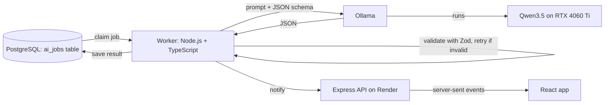

# First Commit: AI Model Setup Guide

| | |
|---|---|
| **Model** | Qwen3.5 (4B for development, 9B to evaluate) |
| **Runtime** | Ollama |
| **Hardware** | NVIDIA RTX 4060 Ti 8GB, 32GB DDR5 RAM |
| **Worker project** | [`apps/worker`](../apps/worker) |
| **Related documents** | project-proposal.md, database-schema.md, [`supabase/migrations/0001_initial_schema.sql`](../supabase/migrations/0001_initial_schema.sql) |

## Table of Contents

1. [What You Are Setting Up](#1-what-you-are-setting-up)
2. [Before You Start](#2-before-you-start)
3. [Install Ollama](#3-install-ollama)
4. [Download the Models](#4-download-the-models)
5. [Configure Ollama for an 8GB GPU](#5-configure-ollama-for-an-8gb-gpu)
6. [Confirm the Model Runs on the GPU](#6-confirm-the-model-runs-on-the-gpu)
7. [Test the API](#7-test-the-api)
8. [Set Up the Worker Project](#8-set-up-the-worker-project)
9. [Run the Setup Check](#9-run-the-setup-check)
10. [Try the Code Review AI](#10-try-the-code-review-ai)
11. [Connect the Worker to the Database](#11-connect-the-worker-to-the-database)
12. [Choose Between 4B and 9B](#12-choose-between-4b-and-9b)
13. [Troubleshooting](#13-troubleshooting)

---

# 1. What You Are Setting Up



- **Ollama** downloads and runs the model and exposes a local API at `http://127.0.0.1:11434`.
- **The worker** is a small Node.js program. It takes one job at a time from the database, builds the prompt, asks Ollama for JSON, checks the JSON against a schema, and saves the result.
- **The React app never talks to Ollama directly.** It asks the Express API, which creates the job; the finished result reaches the browser through server-sent events.
- **The worker connects out, never in.** It pulls jobs from PostgreSQL and posts a short notice to the API when a result is ready, so nothing on the internet needs to reach your machine.

---

# 2. Before You Start

| Requirement | How to check |
|---|---|
| Latest NVIDIA driver | Open **NVIDIA App** (or GeForce Experience) and install updates, then run `nvidia-smi` in a terminal. It should list the RTX 4060 Ti. |
| Node.js 20 or newer | `node -v` |
| About 15 GB free disk space | Both models together are about 10 GB |
| Git | `git --version` |

The commands in this guide use **Windows PowerShell**. Linux equivalents are noted where they differ.

---

# 3. Install Ollama

**Windows**

1. Go to [ollama.com/download](https://ollama.com/download) and download the Windows installer.
2. Run the installer. Ollama starts automatically and shows a llama icon in the system tray.
3. Open a new PowerShell window and run:

   ```powershell
   ollama --version
   ```

**Linux**

```bash
curl -fsSL https://ollama.com/install.sh | sh
ollama --version
```

---

# 4. Download the Models

```powershell
ollama pull qwen3.5:4b
ollama pull qwen3.5:9b
```

| Model | Download size | Use |
|---|---|---|
| `qwen3.5:4b` | About 3.4 GB | Development: fast, fits comfortably in 8 GB VRAM |
| `qwen3.5:9b` | About 6.6 GB | Better quality; fits in 8 GB VRAM with the settings in Section 5 |

Check they installed:

```powershell
ollama list
```

---

# 5. Configure Ollama for an 8GB GPU

The model is not the only thing in GPU memory. The **context cache** (the prompt plus the model's working memory) also uses VRAM, and it grows with context length. These settings keep everything on the GPU.

| Variable | Value | Why |
|---|---|---|
| `OLLAMA_FLASH_ATTENTION` | `1` | Faster and uses less memory; required for the next setting |
| `OLLAMA_KV_CACHE_TYPE` | `q8_0` | Roughly halves context cache memory with almost no quality loss |
| `OLLAMA_CONTEXT_LENGTH` | `8192` | Default context size; the worker sets a larger size only for milestone reviews |
| `OLLAMA_NUM_PARALLEL` | `1` | Each parallel slot needs its own context memory; the worker processes one job at a time anyway |
| `OLLAMA_MAX_LOADED_MODELS` | `1` | Prevents 4B and 9B from both occupying VRAM |
| `OLLAMA_KEEP_ALIVE` | `30m` | Keeps the model loaded between jobs so learners don't wait for reloads. Use `-1` during a demo to keep it loaded permanently. |

Leave `OLLAMA_HOST` unset. By default Ollama only accepts connections from your own computer, which is what you want: the worker runs on the same machine.

**Windows**

1. Quit Ollama: right-click the tray icon and select **Quit Ollama**.
2. Open PowerShell and run:

   ```powershell
   setx OLLAMA_FLASH_ATTENTION 1
   setx OLLAMA_KV_CACHE_TYPE q8_0
   setx OLLAMA_CONTEXT_LENGTH 8192
   setx OLLAMA_NUM_PARALLEL 1
   setx OLLAMA_MAX_LOADED_MODELS 1
   setx OLLAMA_KEEP_ALIVE 30m
   ```

3. Start Ollama again from the Start menu. Settings only apply after a restart.

You can also set these in **Start > "Edit environment variables for your account"**.

**Linux**

```bash
sudo systemctl edit ollama.service
```

Add:

```ini
[Service]
Environment="OLLAMA_FLASH_ATTENTION=1"
Environment="OLLAMA_KV_CACHE_TYPE=q8_0"
Environment="OLLAMA_CONTEXT_LENGTH=8192"
Environment="OLLAMA_NUM_PARALLEL=1"
Environment="OLLAMA_MAX_LOADED_MODELS=1"
Environment="OLLAMA_KEEP_ALIVE=30m"
```

Then restart:

```bash
sudo systemctl daemon-reload
sudo systemctl restart ollama
```

---

# 6. Confirm the Model Runs on the GPU

Start the 9B model with a short prompt:

```powershell
ollama run qwen3.5:9b "Explain a JavaScript array in one sentence."
```

While it is loaded, open a second terminal:

```powershell
ollama ps
```

Look at the **PROCESSOR** column:

| You see | Meaning | Action |
|---|---|---|
| `100% GPU` | Everything fits in VRAM | Good |
| Something like `25%/75% CPU/GPU` | Part of the model spilled into system RAM, which is much slower | See below |

If it spills over:

1. Confirm the Section 5 settings applied (restart Ollama).
2. Close GPU-heavy apps (games, browsers with many video tabs, video editors).
3. Use `AI_CONTEXT=6144` in the worker's `.env` for exercises.
4. If it still spills, use `qwen3.5:4b` for everyday development and test 9B separately.

Also watch memory while it runs:

```powershell
nvidia-smi
```

Stop the interactive session with `/bye`.

---

# 7. Test the API

The worker uses Ollama's API, not the chat window. Test it directly:

**PowerShell**

```powershell
$body = @{
  model = "qwen3.5:4b"
  messages = @(@{ role = "user"; content = "Say hello in one sentence." })
  stream = $false
  think = $false
} | ConvertTo-Json -Depth 5

Invoke-RestMethod -Uri http://127.0.0.1:11434/api/chat -Method Post -ContentType "application/json" -Body $body
```

**Linux or Git Bash**

```bash
curl http://127.0.0.1:11434/api/chat -d '{
  "model": "qwen3.5:4b",
  "messages": [{ "role": "user", "content": "Say hello in one sentence." }],
  "stream": false,
  "think": false
}'
```

You should see a response with `message.content` containing a sentence.

**About thinking mode:** Qwen3.5 can "think" before answering. The `think` setting controls this. Thinking can improve reasoning but is slower. For First Commit's tasks (explaining test results, choosing modules from a list, writing resume text), thinking off is usually fast and good enough, but Section 9 checks what works best on your setup.

---

# 8. Set Up the Worker Project

1. The worker already lives in this repo at `apps/worker`, alongside the React app in `apps/web`.
2. Install dependencies:

   ```powershell
   cd apps\worker
   npm install
   ```

   Or, from the repo root, `npm install` once installs every workspace.

3. Create your settings file:

   ```powershell
   Copy-Item .env.example .env
   ```

4. Open `.env`. For now, only the Ollama section matters:

   ```ini
   OLLAMA_URL=http://127.0.0.1:11434
   AI_MODEL=qwen3.5:4b
   AI_JSON_MODE=think_off_schema
   AI_CONTEXT=8192
   AI_CONTEXT_LARGE=16384
   ```

**What's in the project**

| File | Purpose |
|---|---|
| `src/config.ts` | Reads settings from `.env` |
| `src/ollama.ts` | Calls Ollama, validates JSON with Zod, and retries with the error message when output is invalid |
| `src/schemas.ts` | Output shapes for code feedback, roadmaps, and resumes, plus a check that rejects hints containing code |
| `src/prompts/code-feedback.ts` | Builds the Code Review AI prompt from code, test results, and rubric |
| `src/check-setup.ts` | Checks Ollama and compares JSON modes |
| `src/examples/code-feedback.ts` | Sample run on the "Sum of even numbers" exercise |
| `src/worker.ts` | Claims jobs from PostgreSQL and writes results |

**Why the worker uses Ollama's native API:** Ollama also offers an OpenAI-compatible endpoint, but there have been reported cases of JSON schemas not being enforced through it for Qwen3.5 models. The worker uses the native `/api/chat` endpoint instead. All model calls go through `src/ollama.ts`, so switching to another provider later means changing only that file.

---

# 9. Run the Setup Check

```powershell
npm run check
```

The check confirms Ollama is running and the model is installed, then sends the same request five times in each of three JSON modes:

| Mode | How it asks for JSON |
|---|---|
| `think_off_schema` | Thinking off, JSON schema enforced by Ollama |
| `think_on_schema` | Thinking on, JSON schema enforced by Ollama |
| `prompt_only` | Thinking off, schema described in the prompt; the worker validates the result |

**Why this check exists:** Ollama has had bugs where Qwen3.5 ignored the JSON schema when thinking was turned off. Whether that affects you depends on your Ollama version, so the check tests it on your machine instead of guessing.

Example output:

```
Mode               Valid  First try  Avg time
think_off_schema   5/5    5/5        2.1s
think_on_schema    5/5    5/5        7.8s
prompt_only        5/5    4/5        2.4s

✓ Recommended: set AI_JSON_MODE=think_off_schema in your .env file
```

Copy the recommended mode into `.env`. Run the check again for the 9B model and after every Ollama update:

```powershell
npm run check -- qwen3.5:9b
```

Whatever mode you use, the worker always validates the output and retries up to three times, so an occasional bad response doesn't reach learners.

---

# 10. Try the Code Review AI

```powershell
npm run try:feedback
```

This sends the "Sum of even numbers" example from the design document: a loop that starts at index 1, with two failing tests. You should get JSON like:

```json
{
  "summary": "Your even-number check works, but the first number in the array is never counted.",
  "issues": [
    {
      "line": 3,
      "problem": "The loop starts at index 1, so the first item is skipped.",
      "hint": "Where do array indexes start in JavaScript?"
    }
  ],
  "rubric": [
    { "criterion": "Correctness", "met": false, "note": "2 of 4 tests fail." },
    { "criterion": "Readability", "met": true, "note": "Clear names and simple structure." },
    { "criterion": "Edge cases", "met": true, "note": "Negative numbers are handled." }
  ],
  "encouragement": "Your condition for even numbers is correct."
}
```

Things to check in the result:

- Does it identify line 3 and the starting index?
- Does the hint avoid giving the corrected code? If a hint contains code, `noSolutionLeak` rejects it and the worker asks again. The attempt count at the bottom shows when that happened.
- Do the rubric judgments match the test results?

Run it a few times with both models. The output varies slightly each run.

---

# 11. Connect the Worker to the Database

1. Make sure `supabase/migrations/0001_initial_schema.sql` has been run on your database.
2. In Supabase, go to **Project Settings > Database** and copy the connection string. Use
   the **direct connection** (port 5432) for the worker rather than the pooler, since the
   worker holds one long-lived connection and claims jobs inside a transaction.
3. Fill in the database section of `.env`:

   ```ini
   DATABASE_URL=postgresql://postgres:<password>@<host>:5432/postgres
   WORKER_POLL_MS=3000
   # Where the worker posts "a result is ready" so the API can push it over SSE
   API_URL=https://your-api.onrender.com
   WORKER_SECRET=<the same value set on the API>
   ```

   `.env` is listed in `.gitignore`. Never commit it. The connection string and
   `WORKER_SECRET` belong to the worker and the API only, never to the React app.

4. Start the worker:

   ```powershell
   npm run worker
   ```

5. Test it by inserting a job in the SQL Editor. Replace the user ID with a real one from `users`:

   ```sql
   insert into ai_jobs (type, user_id, source_id, payload) values (
     'code_feedback',
     '<user id>',
     gen_random_uuid(),
     '{
       "exerciseTitle": "Sum of even numbers",
       "instructions": "Return the sum of all even numbers in the array.",
       "language": "JavaScript",
       "files": [{ "path": "script.js", "content": "function sumEven(nums) {\n  let total = 0;\n  for (let i = 1; i < nums.length; i++) {\n    if (nums[i] % 2 === 0) total += nums[i];\n  }\n  return total;\n}" }],
       "testResults": [
         { "name": "Includes the first item", "passed": false, "expected": "2", "actual": "0" },
         { "name": "Ignores odd numbers", "passed": true }
       ],
       "lintResults": [],
       "rubric": [{ "name": "Correctness", "description": "All tests pass" }]
     }'
   );
   ```

6. The worker terminal should print `✓ code_feedback ...`. Check the result:

   ```sql
   select status, attempts, error, completed_at from ai_jobs order by created_at desc limit 1;
   select content from ai_outputs order by created_at desc limit 1;
   ```

**How the worker behaves**

- It claims one job at a time with `claim_next_ai_job()`, which is safe even if you accidentally run two workers.
- A failed job goes back to the queue and is retried up to three times, then marked `failed` with the error.
- After writing a result it posts to `API_URL/internal/events` with `WORKER_SECRET`, so the
  API can push the result to the learner's open SSE stream. If the API is asleep or the post
  fails, the worker retries and the API's periodic sweep picks the row up anyway, so a
  missed notice only delays the update.
- Press `Ctrl + C` to stop. It finishes the current job first.
- Only `code_feedback` is implemented. Add handlers for `roadmap_generation`, `milestone_review`, and `resume_generation` in `src/worker.ts` as you build those features. Their output schemas are already in `src/schemas.ts`.

**Keeping the worker running during a demo:** Open Ollama and start the worker before the presentation, send one test job to load the model into memory, and set `OLLAMA_KEEP_ALIVE=-1` so the model isn't unloaded while you talk.

---

# 12. Choose Between 4B and 9B

Don't decide by feel. Use a small test set, as planned in the proposal's evaluation section.

1. **Build the test set.** Write 15 to 20 exercise submissions with known bugs, plus a few correct ones, in JavaScript, React, and Vue. Record the expected finding for each (for example, "loop starts at index 1").
2. **Run both models** on the same set with the same prompt and JSON mode. Save every output.
3. **Score each output** on bug detection, false alarms, solution leakage, and clarity.
4. **Record speed** from the attempt and duration values the worker returns.

| Result | Choose |
|---|---|
| 9B is clearly more accurate and runs at `100% GPU` | 9B |
| Both are similarly accurate | 4B (faster, more memory headroom) |
| 9B is more accurate but spills to CPU | 4B for exercises; test 9B with smaller context |

Keep prompts versioned in the `ai_prompts` table so your evaluation results match the exact prompt used.

---

# 13. Troubleshooting

| Problem | Likely cause | Fix |
|---|---|---|
| `Cannot reach Ollama` | Ollama isn't running | Start the Ollama app (Windows) or `sudo systemctl start ollama` (Linux) |
| `model is not installed` | Model not downloaded or name typo | `ollama pull qwen3.5:4b` and check `ollama list` |
| Settings seem ignored | Ollama wasn't restarted, or variables were set in the wrong place | Quit Ollama from the tray and reopen; on Linux use `systemctl edit` |
| `ollama ps` shows CPU/GPU split | Model and context don't fit in 8 GB | Section 6 steps; lower `AI_CONTEXT`; close GPU-heavy apps |
| First request takes a long time | Model is loading into VRAM | Normal; later requests are faster while the model stays loaded |
| Empty `content` with text in `thinking` | Thinking mode on without the right setting | Run `npm run check` and use the recommended mode |
| Plain text instead of JSON | Schema ignored in the current mode | Run `npm run check`; update Ollama; the worker retries automatically |
| `Model output was invalid after 3 attempts` | Prompt or schema too complex for the model | Simplify the schema, lower temperature, shorten the prompt, or try 9B |
| Hints contain code | Model ignoring the no-solution rule | `noSolutionLeak` retries automatically; strengthen the prompt if it happens often |
| `Ollama did not respond within 120000 ms` | Very long prompt, or model running on CPU | Check `ollama ps`; raise `AI_TIMEOUT_MS` only after fixing GPU placement |
| `claim_next_ai_job failed` | Schema not run, or a wrong or pooled connection string | Run `supabase/migrations/0001_initial_schema.sql`; use the direct connection string (port 5432) in `DATABASE_URL` |
| Worker saves nothing to `ai_outputs` | Job has no `user_id` or `source_id` | Always create jobs with both |
| Out-of-memory errors | Another app is using VRAM | Close it, or set `OLLAMA_GPU_OVERHEAD` to reserve memory for the desktop |
