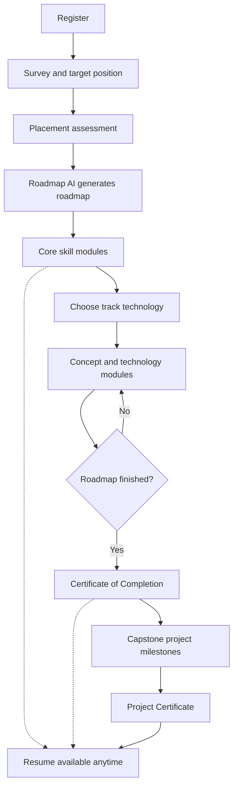
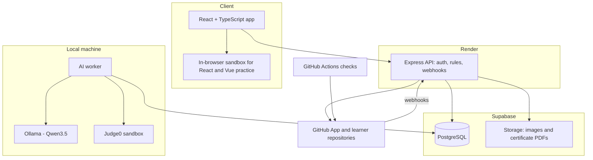

# First Commit: An AI-Assisted Online Learning Platform for Aspiring Programmers

**Project Proposal**

| | |
|---|---|
| **Proponent(s)** | [Name(s)] |
| **Program / Section** | [Program, Section] |
| **Adviser** | [Adviser] |
| **Date** | [Date] |

## Summary

First Commit is an online learning platform for people starting their journey into programming. It guides each learner from their first lesson to a job-ready portfolio through personalized roadmaps, hands-on practice, a real capstone project, and an honest resume.

The platform combines admin-curated content with three AI components:

1. **Roadmap AI** builds a personalized, layered roadmap from the learner's survey, placement results, and target position, and adapts it as the learner progresses.
2. **Code Review AI** gives beginner-friendly feedback on coding exercises and capstone milestones, grounded in actual test and check results.
3. **Resume AI** generates an ATS-friendly resume using only verified skills, earned certificates, and completed projects.

After finishing their roadmap, learners build a capstone project from scratch on their own machine, push it to GitHub, and have their progress tracked milestone by milestone. Learners earn verifiable certificates for completing a roadmap and for completing a capstone project.

The platform is built with React and TypeScript in the browser, a Node.js and Express backend that owns authentication and all business rules, and PostgreSQL for storage. All AI features run on a free, open-weight model (Qwen3.5) hosted locally through Ollama, keeping costs at zero during development and keeping learner code and resume data on the project's own machine.

## Table of Contents

1. [Introduction](#1-introduction)
2. [Scope and Limitations](#2-scope-and-limitations)
3. [Learning Structure](#3-learning-structure)
4. [System Features](#4-system-features)
5. [AI Components](#5-ai-components)
6. [Capstone Projects and Certificates](#6-capstone-projects-and-certificates)
7. [Module Versioning](#7-module-versioning)
8. [System Architecture](#8-system-architecture)
9. [Evaluation Plan](#9-evaluation-plan)
10. [Risks and Future Work](#10-risks-and-future-work)

---

# 1. Introduction

## 1.1 Background of the Study

Interest in programming careers continues to grow, and beginners have more free learning material available than ever. However, abundance creates its own problem. New learners often do not know which topics matter for the job they want, in what order to learn them, which technologies to focus on, or when they are ready to apply. Static roadmaps list everything a role *could* require, but they do not adapt to what a learner already knows, what kind of work they want, or where they struggle.

Even learners who finish courses face a second gap: applying what they learned. Completing lessons and exercises is very different from building a project from an empty folder, where the learner must plan the structure, set up a repository, break down the work, and push through getting stuck. Many beginners never cross this gap, leaving them with course certificates but no portfolio evidence employers can inspect.

A third gap is presentation. Beginners struggle to present their skills in a resume that passes Applicant Tracking Systems (ATS), and generic AI resume builders can make this worse by inflating skills the learner does not actually have.

Recent open-weight language models make it feasible to add personalization and feedback to a learning platform at little or no cost, running on consumer hardware.

## 1.2 Statement of the Problem

The study aims to address the following problems:

1. Beginners lack a learning path tailored to their current skill level, career goals, preferred technologies, and available time, leading to inefficient learning and early dropout.
2. Learners receive little timely, understandable feedback on the code they write.
3. Learners who complete courses often cannot apply their skills by building a project from scratch, leaving them without portfolio evidence.
4. Learners struggle to convert their learning into a credible, ATS-friendly resume that accurately reflects verified skills.
5. Learning platforms that update their content risk disrupting learners who are already in progress.

## 1.3 Objectives

### General Objective

To develop an AI-assisted online learning platform that guides aspiring programmers from their first lesson to a job-ready portfolio through personalized roadmaps, code feedback, guided capstone projects, verifiable certificates, and evidence-based resume generation.

### Specific Objectives

1. To design a layered curriculum structure of career paths, core skills, specialization tracks, technology options, and modules that admins can manage.
2. To develop a Roadmap AI that generates and adapts a personalized roadmap from a learner survey, placement assessment, target position, and performance, selecting only from admin-defined content.
3. To develop a Code Review AI that combines automated tests and checks with model-generated, beginner-friendly feedback for coding exercises and capstone milestones.
4. To implement a capstone project feature where learners build projects locally, push them to GitHub, and have milestone progress tracked and reviewed by the platform.
5. To implement verifiable certificates for roadmap completion and capstone project completion.
6. To develop a Resume AI that generates ATS-friendly resumes using only verified skills, certificates, and projects.
7. To implement a module versioning system that allows admins to update content without disrupting learners' existing roadmaps and progress.
8. To implement a secure backend that owns authentication, permission checks, and all business rules, so learner evidence cannot be altered from the browser.
9. To evaluate the AI components for accuracy and reliability, and the platform for software quality and usability.

## 1.4 Significance of the Study

- **Aspiring programmers** gain an efficient, personalized path to learning, meaningful feedback, a real portfolio project, and a resume that honestly reflects their abilities.
- **Career shifters** can build a second roadmap toward a new role while keeping credit for skills they already have.
- **Educators and content creators** gain a structured way to publish and update learning content, with insight into where learners struggle.
- **Employers** benefit from applicants whose skills, certificates, and projects are verified rather than self-reported.
- **Future researchers** can build on the evaluation of small, locally hosted language models for educational feedback.

---

# 2. Scope and Limitations

## 2.1 Scope

The platform has two user types: **learners** and **admins**.

### Learner Scope

- Account registration, login, and profile management
- Onboarding survey and target position selection
- Placement assessment to measure actual starting skill level
- AI-generated personalized roadmap with core skills, a specialization track, and a technology choice
- Learning modules with lessons, quizzes, and coding exercises
- Testing out of modules by passing their assessment
- AI code review on coding exercises
- Adaptive roadmap changes based on performance
- Access to modules outside the roadmap, and creation of additional roadmaps with shared credit
- Capstone project built locally, pushed to GitHub, and tracked by milestone
- Certificate of Completion and Project Certificate, each publicly verifiable
- AI-generated ATS-friendly resume, available at any time and tailorable to a target position
- Notifications, progress dashboard, and deletion of personal data and account

### Admin Scope

- Management of career paths, core skills, tracks, technology options, and modules
- Management of lessons, quizzes, coding exercises, test cases, and review rubrics
- Draft, preview, and publish workflow with module versioning and impact preview
- Management of capstone project briefs, milestones, checks, and starter templates
- Review of capstone projects flagged for integrity concerns
- Certificate templates, lookup, revocation, and reissue
- Review of AI feedback flagged as incorrect by learners
- Analytics, user management, platform settings, and an activity log of sensitive actions

## 2.2 Minimum Viable Version

To keep development achievable, the first version will prove the full learning loop with limited content:

- **One complete career path:** Junior Web Developer
- **Core skills:** HTML, CSS, JavaScript, and Git, each with modules and assessments
- **One fully built specialization track:** Frontend, with two technology options (React and Vue)
- **Capstone:** at least one project brief with milestones, checks, and starter templates for React and Vue
- **All three AI components**, certificates, resume generation, and module versioning

The full technology catalog (Section 3.3) is defined in the platform structure. Content for tracks beyond Frontend will be built as time allows. Features listed under Future Work (Section 10.2) are outside the minimum version.

## 2.3 Limitations

- **Model capability.** The AI components use a small open-weight model (Qwen3.5 4B or 9B). It is weaker than commercial frontier models and may occasionally miss subtle bugs, produce false alarms, or generate imperfect text. The system design reduces but does not eliminate these errors.
- **Framework knowledge.** Frameworks change often, and the model may know older patterns better than the latest versions. Rubrics and module versioning reduce this risk.
- **Capstone review.** The AI reviews the changes in each milestone, not an entire project at once. Automatic checks verify objective requirements but cannot judge every aspect of project quality.
- **GitHub dependency.** Capstone tracking requires learners to have a GitHub account and depends on GitHub's availability.
- **Integrity.** The platform uses signals to detect copied or outsourced projects but cannot fully prevent them.
- **Concurrency.** Because the model runs locally on a single GPU (RTX 4060 Ti, 8GB VRAM), only a small number of AI requests can be processed at once. The system is intended for development, demonstration, and limited testing, not large-scale deployment.
- **AI availability.** AI features work only while the proponent's machine is running the worker and Ollama. The rest of the platform keeps working without it; affected requests wait in the queue.
- **Hosting limits.** On free hosting plans, the API sleeps after inactivity and takes up to a minute to wake, and the database pauses after a week without use. Both are warmed before demonstrations.
- **Content.** Learning content is limited to what the proponents and admins create for the selected career path and technologies.
- **Employment outcomes.** The study does not measure actual job placement of learners.
- **Language.** The platform and AI outputs are in English only.

---

# 3. Learning Structure

## 3.1 Layered Career Paths

A career path is not a fixed list of modules. It is a set of layers, and the Roadmap AI makes decisions within each one. Learners targeting the same position share a common core, which gives certificates a consistent meaning, while the rest of their roadmap differs based on their goals, technology choice, and performance.

| Layer | Same for everyone? | Description |
|---|---|---|
| **1. Core skills** | Yes | Non-negotiable skills for the role (e.g., HTML, CSS, JavaScript, Git). Learners may only skip modules they have proven through placement or earlier roadmaps. |
| **2. Specialization track** | No | The direction within the role (e.g., Frontend-focused, Full-stack leaning). Recommended by the AI from the learner's goals; chosen by the learner. |
| **3. Technology option** | No | The specific tool the track teaches (e.g., React or Vue). Chosen by the learner after completing the core. |
| **4. Adaptive support** | No | Reinforcement modules when a learner struggles, challenge modules when a learner excels, and pacing changes. |
| **5. Capstone project** | No | A project brief matched to the learner's track and technology. |

## 3.2 Concept Modules and Technology Modules

Within a specialization track, modules are divided into two kinds:

- **Concept modules** teach ideas shared by all technology options, such as components, state, and routing. Every learner in the track takes them.
- **Technology modules** teach how those ideas work in the chosen tool, such as "State in React" or "State in Vue".

This avoids rewriting shared concepts for every technology and helps learners transfer to other technologies later. Technology options may have prerequisites (for example, a future Next.js option would require React).

### Example: Two Learners Targeting Junior Web Developer

| | Learner A | Learner B |
|---|---|---|
| **Survey** | Complete beginner, wants a company job, 10 hours/week | Knows some HTML and CSS, wants freelance work, 5 hours/week |
| **Core** | All core modules | HTML and CSS tested out; starts at Git |
| **Track and technology** | Frontend, React | Frontend, Vue |
| **Adaptive** | Practice module added after struggling with arrays | Challenge module offered after passing JavaScript easily |
| **Capstone** | Task tracker app in React | Responsive business website in Vue |

## 3.3 Technology Catalog

Each specialization offers two common technology options, chosen based on usage in industry surveys and job postings. New options are added only when they are common in job postings.

| Specialization | Concept modules | Technology options |
|---|---|---|
| Frontend | Components, state, routing, data fetching | React, Vue |
| Backend | HTTP, REST APIs, authentication, server logic | Node.js with Express, Python with Django |
| Mobile | Mobile UI, navigation, device storage | React Native, Flutter |
| Database | Data modeling, querying, indexing | PostgreSQL, MongoDB |
| Full-stack | Combines Frontend and Backend concepts | One Frontend option plus one Backend option |

## 3.4 Choosing a Technology

The technology choice happens after the core skills, when learners understand enough to choose meaningfully. On the roadmap, it appears as a decision point where the path forks. The learner:

1. Reads a plain-language comparison of the options.
2. Tries a short taster lesson for each option (for example, the same small counter built in React and in Vue).
3. Receives a recommendation from the Roadmap AI with a brief reason.
4. Makes the final choice.

Learners may switch later. Core skills and concept modules stay passed; only technology modules change. Passed technology modules from the previous choice remain verified skills. After finishing a roadmap, learners may add the other technology's modules.

## 3.5 Three Levels of Evidence

| Evidence | Earned by | Appears on resume as |
|---|---|---|
| **Verified skill** | Passing a module assessment or testing out | Skills section |
| **Certificate of Completion** | Completing the roadmap (core, track, and technology modules) | Certifications section |
| **Project Certificate and project entry** | Completing all capstone milestones | Projects section (with repository and live demo links) and Certifications section |

Module completion is presented as a skill, never as "experience". Hands-on work is represented only by the capstone project.

---

# 4. System Features

## 4.1 Learner Features by Page

| Page | What the learner does |
|---|---|
| **Landing** | Learns what First Commit offers and signs up or logs in |
| **Sign up / Log in** | Creates an account, agrees to privacy consent, or logs in |
| **Onboarding: About you** | Answers 4 to 6 questions about experience, goals, and weekly study hours |
| **Onboarding: Target position** | Chooses the job they are working toward |
| **Onboarding: Placement** | Answers placement questions, with an "I don't know yet" option and no time limit |
| **Onboarding: Roadmap review** | Reviews the generated roadmap and AI explanation, adjusts hours, flags errors, and starts learning |
| **Home** | Continues the current lesson, checks progress, and responds to update notices |
| **Roadmap chart** | Views progress, opens modules, tests out, sees what unlocks locked modules, chooses a technology at the decision point, and manages the roadmap |
| **Module** | Reads lessons in order, jumps between lessons, tests out, and reads update notes |
| **Quiz** | Answers questions, sees results, reviews missed topics, and retakes if needed |
| **Coding exercise** | Writes code, runs tests, reads AI feedback, fixes and resubmits, and flags incorrect feedback |
| **My roadmaps** | Switches between roadmaps and creates a new roadmap for another career |
| **Explore modules** | Searches and takes any published module |
| **Capstone project** | Chooses a project brief, connects a GitHub repository, follows milestones, views check results and AI reviews after each push |
| **Certificates** | Views, downloads, and shares earned certificates |
| **Resume** | Tailors the resume to a path, selects verified evidence, fills in personal details, generates, edits, and downloads |
| **Notifications** | Reads and acts on updates about modules, roadmaps, milestones, and certificates |
| **Settings** | Edits profile, changes password, manages GitHub connection, and deletes data and account |

## 4.2 Admin Purpose

Admins keep the learning content accurate and the learner evidence trustworthy. They make sure there is good content to learn, that the AI behaves correctly, and that every skill, certificate, and project on a resume is meaningful. Admins cannot manually mark modules as passed or edit scores; any correction is a logged override with a reason.

## 4.3 Admin Features by Page

| Page | What the admin does |
|---|---|
| **Overview** | Sees drafts, flagged AI feedback, flagged projects, and struggling modules, with links to handle each |
| **Career paths** | Creates career paths; places core skills; creates tracks and technology options; attaches concept, technology, reinforcement, and challenge modules; sets prerequisites; links capstone briefs; sets certificate requirements |
| **Modules** | Writes lessons, quizzes, exercises, test cases, and rubrics; previews; publishes as minor edit or major revision with impact preview; views history; archives |
| **Capstone projects** | Writes project briefs; defines milestones, acceptance criteria, automatic checks, and AI review checklists; links starter templates per technology; publishes and archives briefs |
| **Project reviews** | Views learners' repositories, milestone progress, and commit history; reviews integrity flags; clears flags, requests explanations or redos, or rejects projects; overrides incorrect checks with a logged reason |
| **Certificates** | Manages certificate templates; searches issued certificates; revokes with a reason; reissues corrected certificates |
| **Flagged AI feedback** | Reviews flagged AI output with full context; marks it correct or wrong; identifies recurring problems |
| **Analytics** | Views funnels from roadmap start to capstone completion; finds modules and milestones with high drop-off; tracks AI flag rates and certificates issued |
| **Users** | Views learner accounts; suspends or reactivates; handles data deletion requests; manages admin accounts |
| **Settings** | Configures AI model and prompts, GitHub App connection, and platform rules such as passing scores |
| **Activity log** | Views a read-only record of sensitive admin actions with who, when, and why |

## 4.4 Main Learner Flow

---

# 5. AI Components

## 5.1 Design Principle

The language model is never the sole source of truth. Each AI component works on top of structured data or verified results that the platform controls. The model personalizes, interprets, and explains, while the platform guarantees correctness where it matters.

All three components share a single **learner profile** containing survey answers, target positions, placement results, track and technology choices, module completions, assessment scores, submissions, capstone progress, and certificates.

## 5.2 Roadmap AI

**Purpose:** Generate and adapt a personalized, layered roadmap.

**Decisions the AI makes:**

| Decision | Based on |
|---|---|
| Which core modules to skip | Placement results and modules passed in other roadmaps |
| Which specialization track to recommend | Survey goals and target position |
| Which technology option to recommend at the decision point | Goals, performance in the core, and track |
| When to add reinforcement modules | Repeated failed or low-scoring assessments |
| When to offer challenge modules | High scores and fast progress |
| How to pace the schedule | Weekly hours and actual progress |
| Which capstone brief to recommend | Track, technology, and goals |

**Process:**
1. The platform retrieves the career path structure: core skills, tracks, technology options, modules, and prerequisites.
2. The model makes its decisions and returns structured JSON (module IDs, order, recommendations, and short reasons).
3. The platform validates the output: every module must exist, prerequisites must be respected, and all core modules must be present unless proven.
4. Invalid output is rejected and regenerated.

**Key constraints:** The model may only choose from existing content. Recommendations are suggestions; the learner makes the final track and technology choice.

## 5.3 Code Review AI

The Code Review AI works in two contexts.

### Coding Exercises

1. The learner submits code.
2. The code runs against the exercise's test cases: single-file JavaScript and Python exercises run in a sandbox (Judge0); React and Vue exercises run in an in-browser sandbox (e.g., Sandpack).
3. A linter checks syntax and style.
4. The model receives the code, test results, linter output, and the exercise rubric, and explains what went wrong in simple language.

### Capstone Milestones

1. The learner pushes code to their connected GitHub repository.
2. The platform runs the milestone's automatic checks (e.g., required files, tests in a provided GitHub Actions workflow, deployment link).
3. The model reviews **only the changes made for that milestone** (the diff), with the check results and the milestone's review checklist.
4. The model gives feedback on what meets the checklist and what to improve.

Reviewing the diff instead of the whole repository keeps the input small enough for the local model.

### Feedback Rules (Both Contexts)

- Give hints and point to the problem; never provide full corrected code.
- Base correctness claims on test and check results, not on the model's reading of the code.
- Follow the rubric or checklist, which describes current, correct practice for the chosen technology.
- Learners can flag feedback as incorrect for admin review.

## 5.4 Resume AI

**Purpose:** Generate an ATS-friendly resume that honestly reflects the learner's abilities.

**Inputs:**
- Verified skills (Section 3.5)
- Certificates earned
- Completed capstone projects with repository and demo links
- Learner-provided personal details
- Selected target position for tailoring

**Process:**
1. The platform compiles only verified evidence.
2. The model writes the summary and project descriptions from that evidence as structured JSON.
3. The platform renders an ATS-friendly layout with standard sections: Summary, Skills, Projects, Certifications, and Education.

**Key constraints:**
- The model cannot add skills, experience, or proficiency levels not supported by evidence.
- Module completion is described as a skill, never as experience.
- The platform cross-checks generated skills against the verified list and removes any that do not match.
- If no capstone project is complete, the Projects section is omitted and the learner is prompted to build one.

## 5.5 Model Selection

| Criteria | Decision |
|---|---|
| Model | Qwen3.5 (4B for development; 9B to be evaluated for final use) |
| License | Apache 2.0 (permits commercial use) |
| Runtime | Ollama, running locally |
| Hardware | 32GB DDR5 RAM, NVIDIA RTX 4060 Ti 8GB |
| Cost | Free (no API fees) |

**Justification:**
- **Free and open-weight**, removing API costs.
- **Runs on available hardware.** The 4B model (about 3.4GB) fits comfortably in 8GB VRAM; the 9B model (about 6.6GB) fits with less headroom.
- **Supports structured output and tool calling**, needed for JSON roadmaps and resumes.
- **One model for all three components**, using different prompts, which reduces memory usage.
- **Privacy.** Learner code and resume data do not leave the local machine.

**Configuration notes:**
- Keep context size modest (about 8K to 16K tokens). Milestone diffs that exceed this are split by file.
- Use JSON schema–constrained output and validate every response. Test early that JSON output works with the chosen thinking-mode setting.
- Queue AI requests, since one GPU handles only one or two requests at a time.

**Portability:** All model calls go through one module in the worker, which uses Ollama's own API because JSON schemas are enforced more reliably there than through its OpenAI-compatible endpoint. Switching to a larger model or a hosted provider means changing that one module.

---

# 6. Capstone Projects and Certificates

## 6.1 Purpose

Finishing modules shows a learner has learned a skill; building a project from scratch shows they can apply it. The capstone bridges this gap with guidance that gradually steps back, and it produces the portfolio evidence employers inspect.

## 6.2 How Tracking Works

Learners build on their own machine and push to a repository on **their own GitHub account**, so the project appears on their real GitHub profile.

1. The learner creates a repository from the provided starter template for their technology.
2. The learner installs the First Commit GitHub App on that repository only.
3. Each push sends an event to the Express API's public address. The worker also checks for new commits periodically, in case a delivery fails while the API is waking from sleep.
4. The platform records commits, runs milestone checks, and triggers the AI review.

Self-hosted Git servers and custom Git hosting were considered but rejected: they require more maintenance, add nothing for learners, and keep projects off the platform employers actually check.

## 6.3 Project Structure

| Element | Description |
|---|---|
| **Project brief** | What to build, the goal, and which skills it applies. Each track offers several briefs matched to technologies. |
| **Starter template** | A GitHub template repository per technology with folder structure, README outline, and check workflow |
| **Milestones** | Ordered steps with acceptance criteria (e.g., set up repository, build layout, add interactivity, fetch data, deploy) |
| **Linked modules** | Each milestone links to the modules it draws on, so stuck learners can revisit them |
| **Automatic checks** | Objective requirements per milestone: required files, passing tests, working deployment link |
| **Review checklist** | Criteria the Code Review AI uses for the milestone diff |

A milestone is complete only when its automatic checks pass.

## 6.4 Integrity Signals

The platform cannot fully prevent copied or outsourced projects, so it raises signals for admin review rather than applying automatic penalties:

- Most of the work arrives in a single commit
- Code is nearly identical to another learner's project
- The learner cannot explain a part of their code when asked after a milestone

Admins may clear the flag, request an explanation or redo, or reject the project.

## 6.5 Certificates

| Certificate | Requirement |
|---|---|
| **Certificate of Completion** | All required modules in the roadmap passed or tested out |
| **Project Certificate** | All capstone milestones completed and not rejected |

Certificates name the career path, track, and technology (e.g., "Junior Web Developer, Frontend track with React"). They are issued automatically when requirements are met; admins do not issue them by hand.

**Verification:** Each certificate has a unique ID and a public verification page (linked by URL and QR code) showing the learner's name, what the certificate covers, the issue date, and whether it is valid or revoked.

---

# 7. Module Versioning

## 7.1 The Problem

If roadmaps point directly to modules, any change to a module instantly changes every roadmap that uses it, which can alter content a learner is midway through, invalidate completed work, or change progress without warning.

## 7.2 Solution: Separate Templates, Roadmaps, and Versions

| Concept | Owner | Description |
|---|---|---|
| **Career path structure** | Admin | Defines core skills, tracks, technology options, and modules |
| **Learner roadmap** | Learner | A personal snapshot generated from the structure at a point in time |
| **Module version** | Admin | Each major revision of a module is stored as a new version |

Learner progress is recorded against a specific module version. The same rules apply to capstone briefs and milestones.

## 7.3 Update Rules

| Change type | Examples | Effect on learners |
|---|---|---|
| **Minor edit** | Typo fix, clearer wording, fixed link | Applied immediately; no new version |
| **Major revision** | New content, changed exercise or assessment | New version created. In-progress learners finish their current version. Completed learners keep credit and see an optional notice. New learners receive the latest version. |
| **Module added to a path** | New required topic | Not forced into existing roadmaps. Learners are notified and may add it. |
| **Module removed** | Outdated topic | Archived, never deleted. In-progress learners may finish. Completed learners keep credit. Hidden from new roadmaps. |
| **Technology option added** | New framework | Available at decision points for new and switching learners |

## 7.4 Impact Preview

Before publishing a major revision, addition, or removal, the admin sees how many active roadmaps include the item, how many learners are currently taking it, and how many have completed it, then confirms.

---

# 8. System Architecture

## 8.1 Architecture Overview

**Flow summary:**
- The browser talks only to the Express API. Every permission check happens there, because no browser reaches the database.
- Coding exercises are graded on the server: Judge0 for single-file JavaScript and Python, and a Node test runner for React and Vue. The in-browser sandbox is only for instant practice, since results from the browser could be tampered with.
- Capstone pushes arrive as GitHub webhooks at the API's public address, so no tunneling tool is needed during development.
- The AI worker runs on the proponent's machine beside Ollama, claims jobs from the database, and writes results back. It only makes outgoing connections, so it does not need to be reachable from the internet.
- Finished feedback, check results, and notifications reach the browser through server-sent events.

## 8.2 Technology Stack

| Layer | Technology |
|---|---|
| Frontend | React with TypeScript |
| Backend | Node.js with Express (TypeScript) |
| Authentication | Built into the backend: hashed passwords, database-stored sessions, email verification and password reset |
| Database | PostgreSQL, hosted on Supabase |
| File storage | Supabase Storage |
| API hosting | Render (Singapore region) |
| Exercise execution | Judge0 (single-file), in-browser sandbox for React and Vue practice, Node test runner for grading |
| Capstone tracking | GitHub App, GitHub template repositories, GitHub Actions |
| AI runtime | Ollama, running on the proponent's machine |
| AI model | Qwen3.5 (4B / 9B) |
| Live updates | Server-sent events from the Express API |

**Why this stack:** Node with Express lets the API and the AI worker share one TypeScript codebase, and it is also one of the backend technologies First Commit teaches. Keeping authentication in the backend gives the project full control over accounts and avoids depending on a hosted auth provider, at the cost of implementing password hashing, sessions, and reset flows carefully (Section 10.1).

## 8.3 Core Data Model

| Entity | Key fields | Notes |
|---|---|---|
| **User** | id, email, password_hash, full_name, role, status, email_verified_at | Accounts are owned by the backend |
| **Session** | id, user_id, token_hash, expires_at | Stored in the database so sessions survive restarts |
| **EmailVerificationToken / PasswordResetToken** | user_id, token_hash, expires_at, used_at | Hashed, expiring, single use |
| **AuthAttempt** | email, ip_address, kind, succeeded, created_at | Supports rate limiting and lockout |
| **LearnerProfile** | user_id, survey answers, onboarding_step | Shared by all AI components |
| **GitHubConnection** | user_id, github_username, installation_id | |
| **CareerPath** | id, title, status | |
| **Skill** | id, name, layer (core/track) | |
| **Track** | id, career_path_id, title, description | e.g., Frontend |
| **TechnologyOption** | id, track_id, name, status | e.g., React, Vue |
| **TechnologyPrerequisite** | option_id, requires_option_id | e.g., Next.js requires React |
| **Module** | id, skill_id, kind, technology_option_id, status | kind: core, concept, technology, reinforcement, challenge |
| **ModuleVersion** | id, module_id, version_no, content, status | |
| **Prerequisite** | module_id, requires_module_id | |
| **Assessment** | id, module_version_id, type | quiz or code |
| **TestCase** | id, assessment_id, input, expected_output, visible | |
| **Rubric** | id, assessment_id, criteria | |
| **Roadmap** | id, user_id, career_path_id, track_id, technology_option_id, status | |
| **RoadmapItem** | roadmap_id, module_id, order, source | source: AI, learner, reinforcement, challenge |
| **ModuleCompletion** | user_id, module_version_id, score, method, completed_at | Per module, not per roadmap |
| **Submission** | id, user_id, assessment_id, code, test_results | |
| **CapstoneBrief** | id, track_id, title, status | |
| **CapstoneBriefVersion** | id, brief_id, version_no, content | |
| **StarterTemplate** | id, brief_version_id, technology_option_id, repo_url | |
| **Milestone** | id, brief_version_id, order, criteria, checklist | |
| **MilestoneCheck** | id, milestone_id, type, config | file, workflow test, deployment |
| **CapstoneProject** | id, user_id, roadmap_id, brief_version_id, repo_url, demo_url, status | |
| **MilestoneAttempt** | id, project_id, milestone_id, commit_sha, check_results, status | |
| **IntegrityFlag** | id, project_id, reason, status, admin_decision | |
| **CheckOverride** | id, attempt_id, admin_id, reason | |
| **AIFeedback** | id, source_type, source_id, content, flagged, admin_notes | Exercises, milestones, roadmaps, resumes |
| **Certificate** | id, user_id, type, public_code, roadmap_id, project_id, status, revoked_reason | |
| **Resume** | id, user_id, target_career_path_id, content_json, generated_at | |
| **Notification** | id, user_id, type, message, read | |
| **AdminActivityLog** | id, admin_id, action, target, reason, created_at | Read-only |

## 8.4 Data Privacy

The platform stores personal information such as names, contact details, GitHub usernames, and resume content. It will follow the principles of the Data Privacy Act of 2012 (Republic Act No. 10173):

- Collect only data needed for the platform's functions
- Obtain consent during registration and when connecting GitHub
- Store passwords only as argon2id or bcrypt hashes, and session and reset tokens only as hashes
- Send session cookies as `httpOnly` and `secure`, and rate-limit login and password reset attempts
- Request GitHub access only to the repositories learners select
- Run AI processing locally so learner data is not sent to third-party AI providers
- Show only the learner's name and certificate details on public verification pages
- Allow learners to delete their data and account, which cascades to sessions, tokens, and all learner-owned records
- Restrict admin access to personal data to what administration requires, and log sensitive actions

---

# 9. Evaluation Plan

## 9.1 AI Component Evaluation

A fixed test set will be prepared before the final model is chosen. Both Qwen3.5 4B and 9B will be run on the same test set, and results will determine which size is used.

### Code Review AI: Exercises

**Test set:** 15 to 20 beginner submissions with known, documented bugs, plus several correct submissions, covering JavaScript, React, and Vue.

| Metric | Description |
|---|---|
| Bug detection rate | Percentage of known bugs the feedback correctly identifies |
| False alarm rate | Percentage of feedback items reporting a problem that does not exist |
| Solution leakage rate | Percentage of responses that give away the full corrected code |
| Explanation clarity | Rated by evaluators (e.g., 1 to 5) |
| Response time | Average time to generate feedback |

### Code Review AI: Capstone Milestones

**Test set:** Sample milestone diffs that meet, partially meet, and fail their checklists.

| Metric | Description |
|---|---|
| Checklist accuracy | Agreement between AI assessment and evaluator assessment per checklist item |
| Actionability | Rated by evaluators on whether feedback gives a clear next step |

### Roadmap AI

**Test set:** Sample learner profiles with varied experience, goals, and performance histories.

| Metric | Description |
|---|---|
| Valid output rate | Percentage of responses that are valid JSON with existing module IDs |
| Prerequisite violations | Modules placed before their prerequisites |
| Core coverage | Unproven core modules missing from roadmaps (should be zero) |
| Track recommendation appropriateness | Evaluator agreement with the recommended track |
| Adaptation appropriateness | Evaluator agreement with added reinforcement or challenge modules |

### Resume AI

**Test set:** Sample learner profiles at each evidence level (skills only, certificate, completed project).

| Metric | Description |
|---|---|
| Fabrication rate | Percentage of resumes containing claims not in verified evidence |
| Experience misrepresentation | Resumes describing module completion as experience |
| Valid output rate | Percentage of valid JSON responses |
| ATS parse check | Whether resumes are correctly parsed by an ATS resume checker |
| Writing quality | Rated by evaluators |

## 9.2 System Evaluation

### Functional Testing

Test cases covering each feature in Section 4, including:
- Major module revision while a learner is mid-module
- Module removal after learners have completed it
- Second roadmap reusing completed modules
- Choosing, then switching, a technology option
- Pushing to a connected repository and passing or failing milestone checks
- Automatic certificate issuance, public verification, and revocation
- Resume content at each evidence level

### Security Testing

Endpoint tests covering the rules that the backend now enforces alone:
- A learner cannot read or change another learner's roadmap, submissions, project, or certificates
- A learner cannot reach admin endpoints
- Quiz answer keys, hidden test cases, reference solutions, and rubrics never appear in learner responses
- Completions, scores, and certificates cannot be set from a request body
- Login and password reset are rate-limited, and reset links expire and work only once

### Software Quality Evaluation

The platform may be evaluated using ISO/IEC 25010 quality characteristics, such as functional suitability, performance efficiency, usability, reliability, and security, through a survey of respondents (e.g., beginner learners, IT students, and IT professionals).

### Usability Testing

Selected beginner learners will complete onboarding, one module, a coding exercise, the first capstone milestone, and resume generation, followed by a usability questionnaire and short feedback session.

---

# 10. Risks and Future Work

## 10.1 Risks and Mitigations

| Risk | Impact | Mitigation |
|---|---|---|
| AI gives incorrect code feedback | Learners are misled | Tests and checks run first; rubrics and checklists; flagging; admin review |
| Resume AI fabricates skills | Learners are misrepresented to employers | Evidence-only generation; cross-check against verified skills |
| Model returns invalid JSON | Features break | JSON schema–constrained output; validation and regeneration |
| Model knows outdated framework patterns | Misleading feedback | Technology-specific rubrics; module versioning; admin review of flags |
| Copied or outsourced capstone projects | Certificates lose credibility | Integrity signals; admin review; certificate revocation |
| GitHub unavailable or webhooks unreachable during development | Capstone tracking delayed | Periodic polling fallback; tunneling during development |
| Learners overwhelmed by capstone | Low project completion | Starter templates; milestones; linked modules; project briefs to choose from |
| Module updates disrupt learners | Lost progress, confusion | Versioning, update rules, impact preview |
| Content volume across tracks and technologies | Incomplete system | One complete path and track in the minimum version; others as time allows |
| Limited GPU capacity | Slow responses under load | Request queue; modest context; diffs split by file; limited test users |
| Personal data exposure | Privacy violation | Local AI; consent; minimal GitHub access; data deletion; activity log |
| A missing permission check in the backend exposes another learner's data | Serious privacy breach | Session-based user id on every query; ownership checks on every id in a URL; endpoint tests for each rule; a documented checklist (database-schema.md, Section 6) |
| Weak authentication (password storage, reset links, session cookies) | Account compromise | Hashed passwords and tokens; expiring single-use links; secure cookies; rate limiting; an established auth library rather than hand-written cryptography |
| Free-plan sleeping breaks a demo or a webhook delivery | Failed demonstration, missed capstone push | Warm the service beforehand; the worker also checks GitHub for new commits; paid plan during the defense month |

## 10.2 Future Work

- **Additional technology options:** e.g., Angular, Next.js, Nuxt, Laravel, Spring Boot, Kotlin
- **Content for all specialization tracks** in the technology catalog
- **Roadmaps from job postings:** learners paste a job posting and the AI builds a roadmap around the skill gaps
- **Learner-proposed capstone ideas**, with AI or admin scope review
- **Mock interviews:** AI-driven technical and behavioral interview practice
- **Separate admin roles:** content creators versus platform administrators
- **Larger or hosted models** for production scale, by replacing the worker's single model module
- **Employment outcome tracking:** long-term study of whether learners obtain tech jobs
